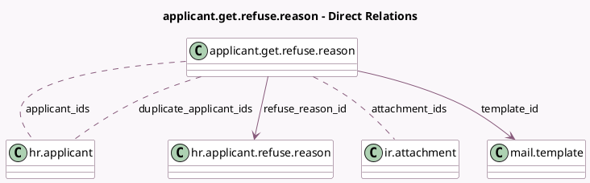

<!-- GENERATED:MODEL -->
---
tags: [odoo, community, generated, model]
---

# applicant.get.refuse.reason

- Module: [[docs/Community Addons/hr_recruitment/hr_recruitment|hr_recruitment]]
- Scope: Community Addons
- Defined in module: yes
- Source files: `wizard/applicant_refuse_reason.py`
- Python classes: `ApplicantGetRefuseReason`
- Description: Get Refuse Reason
- Inherits: `mail.composer.mixin`

## Field footprint

- Detected fields: 11
- Field types: `Binary` x 1, `Boolean` x 2, `Char` x 1, `Integer` x 1, `Many2many` x 3, `Many2one` x 2, `Text` x 1
- Relation fields: 5

## Sample fields

- `applicant_ids`: `Many2many` (comodel `hr.applicant`)
- `applicant_without_email`: `Text` (compute `_compute_applicant_without_email`)
- `attachment_ids`: `Many2many` (comodel `ir.attachment`, compute `_compute_from_template_id`, store `True`)
- `duplicate_applicant_ids`: `Many2many` (comodel `hr.applicant`, compute `_compute_duplicate_applicant_ids`, store `True`)
- `duplicate_applicant_ids_domain`: `Binary` (compute `_compute_duplicate_applicant_ids_domain`)
- `duplicates`: `Boolean`
- `duplicates_count`: `Integer` (comodel `Duplicates Count`, compute `_compute_duplicate_applicant_ids_domain`)
- `refuse_reason_id`: `Many2one` (comodel `hr.applicant.refuse.reason`)
- `scheduled_date`: `Char` (comodel `Scheduled Date`, compute `_compute_from_template_id`, store `True`)
- `send_mail`: `Boolean` (comodel `Send Email`)
- `template_id`: `Many2one` (comodel `mail.template`, compute `_compute_template_id`, store `True`)

## Method hints

- Detected methods: 11
- Action methods: `action_refuse_reason_apply`
- Compute methods: `_compute_applicant_without_email`, `_compute_duplicate_applicant_ids`, `_compute_duplicate_applicant_ids_domain`, `_compute_from_template_id`, `_compute_render_model`, `_compute_template_id`
- Onchange methods: none

## Direct relation diagram

## Navigation

- **Parent:** [[docs/Community Addons/hr_recruitment/Models]]

<!-- GENERATED:MODEL -->
