<!-- GENERATED:MODEL -->
---
tags: [odoo, community, generated, model]
---

# applicant.send.mail

- Module: [[docs/Community Addons/hr_recruitment/hr_recruitment|hr_recruitment]]
- Scope: Community Addons
- Defined in module: yes
- Source files: `wizard/applicant_send_mail.py`
- Python classes: `ApplicantSendMail`
- Description: Send mails to applicants
- Inherits: `mail.composer.mixin`

## Field footprint

- Detected fields: 3
- Field types: `Many2many` x 2, `Many2one` x 1
- Relation fields: 3

## Sample fields

- `applicant_ids`: `Many2many` (comodel `hr.applicant`)
- `attachment_ids`: `Many2many` (comodel `ir.attachment`, store `True`)
- `author_id`: `Many2one` (comodel `res.partner`)

## Method hints

- Detected methods: 2
- Action methods: `action_send`
- Compute methods: `_compute_render_model`
- Onchange methods: none

## Direct relation diagram

```plantuml
@startuml
!define ODOO_COLOR_PRIMARY #714B67
!define ODOO_COLOR_ACCENT #875A7B
!define ODOO_COLOR_BG #FAF7FA

skinparam backgroundColor ODOO_COLOR_BG
skinparam defaultTextAlignment left
skinparam ArrowColor ODOO_COLOR_ACCENT
skinparam ClassBackgroundColor white
skinparam ClassBorderColor ODOO_COLOR_PRIMARY
skinparam ComponentBackgroundColor white
skinparam ComponentBorderColor ODOO_COLOR_PRIMARY
skinparam NoteBackgroundColor #FFF8FF
skinparam NoteBorderColor ODOO_COLOR_ACCENT
skinparam SequenceLifeLineBorderColor ODOO_COLOR_ACCENT
skinparam SequenceLifeLineBackgroundColor #FFFFFF
skinparam SequenceParticipantBorderColor ODOO_COLOR_PRIMARY
skinparam SequenceParticipantBackgroundColor #FFFFFF
skinparam sequence {
  ArrowColor ODOO_COLOR_ACCENT
  ActorBorderColor ODOO_COLOR_PRIMARY
}
title applicant.send.mail - Direct Relations
class "applicant.send.mail" as applicant_send_mail
class "hr.applicant" as hr_applicant
class "ir.attachment" as ir_attachment
class "res.partner" as res_partner
applicant_send_mail .. hr_applicant : applicant_ids
applicant_send_mail --> res_partner : author_id
applicant_send_mail .. ir_attachment : attachment_ids
@enduml
```

## Navigation

- **Parent:** [[docs/Community Addons/hr_recruitment/Models]]

<!-- GENERATED:MODEL -->
