<!-- GENERATED:MODEL -->
---
tags: [odoo, community, generated, model]
---

# hr.applicant

- Module: [[docs/Community Addons/hr_recruitment/hr_recruitment|hr_recruitment]]
- Scope: Community Addons
- Defined in module: yes
- Source files: `models/hr_applicant.py`
- Python classes: `HrApplicant`
- Description: Applicant
- Inherits: `mail.activity.mixin`, `mail.thread.blacklist`, `mail.thread.cc`, `mail.thread.main.attachment`, `mail.thread.phone`, `mail.tracking.duration.mixin`, and 1 more

## Field footprint

- Detected fields: 61
- Field types: `Boolean` x 4, `Char` x 15, `Date` x 2, `Datetime` x 5, `Float` x 6, `Html` x 1, `Integer` x 5, `Many2many` x 3, `Many2one` x 14, `One2many` x 2, `Properties` x 1, `Selection` x 3
- Relation fields: 19

## Sample fields

- `active`: `Boolean` (comodel `Active`)
- `applicant_notes`: `Html`
- `applicant_properties`: `Properties` (comodel `Properties`)
- `application_count`: `Integer` (compute `_compute_application_count`)
- `application_status`: `Selection` (compute `_compute_application_status`)
- `attachment_ids`: `One2many` (comodel `ir.attachment`)
- `attachment_number`: `Integer` (compute `_get_attachment_number`)
- `availability`: `Date` (comodel `Availability`)
- `campaign_id`: `Many2one`
- `categ_ids`: `Many2many` (comodel `hr.applicant.category`)
- `color`: `Integer` (comodel `Color Index`)
- `company_id`: `Many2one` (comodel `res.company`, compute `_compute_company`, store `True`)
- `create_date`: `Datetime` (comodel `Applied on`)
- `date_closed`: `Datetime` (comodel `Hire Date`, compute `_compute_date_closed`, store `True`)
- `date_last_stage_update`: `Datetime` (comodel `Last Stage Update`)
- `date_open`: `Datetime` (comodel `Assigned`)
- `day_close`: `Float` (compute `_compute_day`)
- `day_open`: `Float` (compute `_compute_day`)
- `delay_close`: `Float` (compute `_compute_delay`, store `True`)
- `department_id`: `Many2one` (comodel `hr.department`, compute `_compute_department`, store `True`)

## Method hints

- Detected methods: 55
- Action methods: `action_archive`, `action_create_meeting`, `action_job_add_applicants`, `action_open_applications`, `action_open_attachments`, `action_open_employee`, `action_send_email`, `action_talent_pool_add_applicants`, and 2 more
- Compute methods: `_compute_application_count`, `_compute_application_status`, `_compute_company`, `_compute_date_closed`, `_compute_day`, `_compute_delay`, `_compute_department`, `_compute_display_name`, and 8 more
- Onchange methods: none

## Direct relation diagram

```plantuml
@startuml
!define ODOO_COLOR_PRIMARY #714B67
!define ODOO_COLOR_ACCENT #875A7B
!define ODOO_COLOR_BG #FAF7FA

skinparam backgroundColor ODOO_COLOR_BG
skinparam defaultTextAlignment left
skinparam ArrowColor ODOO_COLOR_ACCENT
skinparam ClassBackgroundColor white
skinparam ClassBorderColor ODOO_COLOR_PRIMARY
skinparam ComponentBackgroundColor white
skinparam ComponentBorderColor ODOO_COLOR_PRIMARY
skinparam NoteBackgroundColor #FFF8FF
skinparam NoteBorderColor ODOO_COLOR_ACCENT
skinparam SequenceLifeLineBorderColor ODOO_COLOR_ACCENT
skinparam SequenceLifeLineBackgroundColor #FFFFFF
skinparam SequenceParticipantBorderColor ODOO_COLOR_PRIMARY
skinparam SequenceParticipantBackgroundColor #FFFFFF
skinparam sequence {
  ArrowColor ODOO_COLOR_ACCENT
  ActorBorderColor ODOO_COLOR_PRIMARY
}
title hr.applicant - Direct Relations
class "hr.applicant" as hr_applicant
class "calendar.event" as calendar_event
class "hr.applicant" as hr_applicant
class "hr.applicant.category" as hr_applicant_category
class "hr.applicant.refuse.reason" as hr_applicant_refuse_reason
class "hr.department" as hr_department
class "hr.employee" as hr_employee
class "hr.job" as hr_job
class "hr.recruitment.degree" as hr_recruitment_degree
class "hr.recruitment.stage" as hr_recruitment_stage
class "hr.talent.pool" as hr_talent_pool
class "ir.attachment" as ir_attachment
class "res.company" as res_company
hr_applicant --> res_partner : partner_id
hr_applicant --> hr_recruitment_degree : type_id
hr_applicant --> hr_employee : employee_id
hr_applicant --> hr_recruitment_stage : stage_id
hr_applicant --> hr_recruitment_stage : last_stage_id
hr_applicant .. hr_applicant_category : categ_ids
hr_applicant --> res_company : company_id
hr_applicant --> res_users : user_id
hr_applicant --> hr_job : job_id
hr_applicant --> hr_department : department_id
hr_applicant --|> ir_attachment : attachment_ids
hr_applicant --> hr_applicant_refuse_reason : refuse_reason_id
hr_applicant --|> calendar_event : meeting_ids
hr_applicant .. res_users : interviewer_ids
hr_applicant .. hr_talent_pool : talent_pool_ids
@enduml
```

## Navigation

- **Parent:** [[docs/Community Addons/hr_recruitment/Models]]

<!-- GENERATED:MODEL -->
