<!-- GENERATED:MODEL -->
---
tags: [odoo, community, generated, model]
---

# hr.applicant.refuse.reason

- Module: [[docs/Community Addons/hr_recruitment/hr_recruitment|hr_recruitment]]
- Scope: Community Addons
- Defined in module: yes
- Source files: `models/hr_applicant_refuse_reason.py`
- Python classes: `HrApplicantRefuseReason`
- Description: Refuse Reason of Applicant

## Field footprint

- Detected fields: 4
- Field types: `Boolean` x 1, `Char` x 1, `Integer` x 1, `Many2one` x 1
- Relation fields: 1

## Sample fields

- `active`: `Boolean` (comodel `Active`)
- `name`: `Char` (comodel `Description`)
- `sequence`: `Integer`
- `template_id`: `Many2one` (comodel `mail.template`)

## Method hints

- Detected methods: 0
- Action methods: none
- Compute methods: none
- Onchange methods: none

## Direct relation diagram

```plantuml
@startuml
!define ODOO_COLOR_PRIMARY #714B67
!define ODOO_COLOR_ACCENT #875A7B
!define ODOO_COLOR_BG #FAF7FA

skinparam backgroundColor ODOO_COLOR_BG
skinparam defaultTextAlignment left
skinparam ArrowColor ODOO_COLOR_ACCENT
skinparam ClassBackgroundColor white
skinparam ClassBorderColor ODOO_COLOR_PRIMARY
skinparam ComponentBackgroundColor white
skinparam ComponentBorderColor ODOO_COLOR_PRIMARY
skinparam NoteBackgroundColor #FFF8FF
skinparam NoteBorderColor ODOO_COLOR_ACCENT
skinparam SequenceLifeLineBorderColor ODOO_COLOR_ACCENT
skinparam SequenceLifeLineBackgroundColor #FFFFFF
skinparam SequenceParticipantBorderColor ODOO_COLOR_PRIMARY
skinparam SequenceParticipantBackgroundColor #FFFFFF
skinparam sequence {
  ArrowColor ODOO_COLOR_ACCENT
  ActorBorderColor ODOO_COLOR_PRIMARY
}
title hr.applicant.refuse.reason - Direct Relations
class "hr.applicant.refuse.reason" as hr_applicant_refuse_reason
class "mail.template" as mail_template
hr_applicant_refuse_reason --> mail_template : template_id
@enduml
```

## Navigation

- **Parent:** [[docs/Community Addons/hr_recruitment/Models]]

<!-- GENERATED:MODEL -->
