<!-- GENERATED:MODEL -->
---
tags: [odoo, community, generated, model]
---

# hr.job

- Module: [[docs/Community Addons/hr_recruitment/hr_recruitment|hr_recruitment]]
- Scope: Community Addons
- Defined in module: yes
- Source files: `models/hr_job.py`
- Python classes: `HrJob`
- Inherits: `mail.activity.mixin`, `mail.alias.mixin`

## Field footprint

- Detected fields: 29
- Field types: `Boolean` x 1, `Integer` x 13, `Many2many` x 3, `Many2one` x 6, `One2many` x 3, `Properties` x 1, `PropertiesDefinition` x 1, `Text` x 1
- Relation fields: 12

## Sample fields

- `activity_count`: `Integer` (compute `_compute_activities`)
- `address_id`: `Many2one` (comodel `res.partner`)
- `alias_id`: `Many2one`
- `all_application_count`: `Integer` (compute `_compute_all_application_count`)
- `applicant_hired`: `Integer` (compute `_compute_applicant_hired`)
- `applicant_properties_definition`: `PropertiesDefinition` (comodel `Applicant Properties`)
- `application_count`: `Integer` (compute `_compute_application_count`)
- `application_ids`: `One2many` (comodel `hr.applicant`)
- `color`: `Integer` (comodel `Color Index`)
- `document_ids`: `One2many` (comodel `ir.attachment`, compute `_compute_document_ids`)
- `documents_count`: `Integer` (compute `_compute_document_ids`)
- `employee_count`: `Integer` (compute `_compute_employee_count`)
- `expected_degree`: `Many2one` (comodel `hr.recruitment.degree`)
- `expected_employees`: `Integer`
- `extended_interviewer_ids`: `Many2many` (comodel `res.users`, compute `_compute_extended_interviewer_ids`, store `True`)
- `favorite_user_ids`: `Many2many` (comodel `res.users`)
- `industry_id`: `Many2one` (comodel `res.partner.industry`)
- `interviewer_ids`: `Many2many` (comodel `res.users`)
- `is_favorite`: `Boolean` (compute `_compute_is_favorite`)
- `job_properties`: `Properties` (comodel `Properties`)

## Method hints

- Detected methods: 26
- Action methods: `action_open_activities`, `action_open_attachments`, `action_open_employees`
- Compute methods: `_compute_activities`, `_compute_all_application_count`, `_compute_applicant_hired`, `_compute_application_count`, `_compute_document_ids`, `_compute_employee_count`, `_compute_extended_interviewer_ids`, `_compute_is_favorite`, and 4 more
- Onchange methods: none

## Direct relation diagram

```plantuml
@startuml
!define ODOO_COLOR_PRIMARY #714B67
!define ODOO_COLOR_ACCENT #875A7B
!define ODOO_COLOR_BG #FAF7FA

skinparam backgroundColor ODOO_COLOR_BG
skinparam defaultTextAlignment left
skinparam ArrowColor ODOO_COLOR_ACCENT
skinparam ClassBackgroundColor white
skinparam ClassBorderColor ODOO_COLOR_PRIMARY
skinparam ComponentBackgroundColor white
skinparam ComponentBorderColor ODOO_COLOR_PRIMARY
skinparam NoteBackgroundColor #FFF8FF
skinparam NoteBorderColor ODOO_COLOR_ACCENT
skinparam SequenceLifeLineBorderColor ODOO_COLOR_ACCENT
skinparam SequenceLifeLineBackgroundColor #FFFFFF
skinparam SequenceParticipantBorderColor ODOO_COLOR_PRIMARY
skinparam SequenceParticipantBackgroundColor #FFFFFF
skinparam sequence {
  ArrowColor ODOO_COLOR_ACCENT
  ActorBorderColor ODOO_COLOR_PRIMARY
}
title hr.job - Direct Relations
class "hr.job" as hr_job
class "hr.applicant" as hr_applicant
class "hr.employee" as hr_employee
class "hr.recruitment.degree" as hr_recruitment_degree
class "hr.recruitment.source" as hr_recruitment_source
class "ir.attachment" as ir_attachment
class "res.partner" as res_partner
class "res.partner.industry" as res_partner_industry
class "res.users" as res_users
hr_job --> res_partner : address_id
hr_job --|> hr_applicant : application_ids
hr_job --> hr_employee : manager_id
hr_job --|> ir_attachment : document_ids
hr_job .. res_users : favorite_user_ids
hr_job .. res_users : interviewer_ids
hr_job .. res_users : extended_interviewer_ids
hr_job --> res_partner_industry : industry_id
hr_job --> hr_recruitment_degree : expected_degree
hr_job --|> hr_recruitment_source : job_source_ids
@enduml
```

## Navigation

- **Parent:** [[docs/Community Addons/hr_recruitment/Models]]

<!-- GENERATED:MODEL -->
