<!-- GENERATED:MODEL -->
---
tags: [odoo, community, generated, model]
---

# hr.recruitment.source

- Module: [[docs/Community Addons/hr_recruitment/hr_recruitment|hr_recruitment]]
- Scope: Community Addons
- Defined in module: yes
- Source files: `models/hr_recruitment_source.py`
- Python classes: `HrRecruitmentSource`
- Description: Source of Applicants
- Inherits: `utm.source.mixin`

## Field footprint

- Detected fields: 6
- Field types: `Char` x 2, `Many2one` x 4
- Relation fields: 4

## Sample fields

- `alias_id`: `Many2one` (comodel `mail.alias`)
- `campaign_id`: `Many2one` (comodel `utm.campaign`)
- `email`: `Char` (related `alias_id.display_name`)
- `has_domain`: `Char` (compute `_compute_has_domain`)
- `job_id`: `Many2one` (comodel `hr.job`)
- `medium_id`: `Many2one` (comodel `utm.medium`)

## Method hints

- Detected methods: 4
- Action methods: none
- Compute methods: `_compute_has_domain`
- Onchange methods: none

## Direct relation diagram

```plantuml
@startuml
!define ODOO_COLOR_PRIMARY #714B67
!define ODOO_COLOR_ACCENT #875A7B
!define ODOO_COLOR_BG #FAF7FA

skinparam backgroundColor ODOO_COLOR_BG
skinparam defaultTextAlignment left
skinparam ArrowColor ODOO_COLOR_ACCENT
skinparam ClassBackgroundColor white
skinparam ClassBorderColor ODOO_COLOR_PRIMARY
skinparam ComponentBackgroundColor white
skinparam ComponentBorderColor ODOO_COLOR_PRIMARY
skinparam NoteBackgroundColor #FFF8FF
skinparam NoteBorderColor ODOO_COLOR_ACCENT
skinparam SequenceLifeLineBorderColor ODOO_COLOR_ACCENT
skinparam SequenceLifeLineBackgroundColor #FFFFFF
skinparam SequenceParticipantBorderColor ODOO_COLOR_PRIMARY
skinparam SequenceParticipantBackgroundColor #FFFFFF
skinparam sequence {
  ArrowColor ODOO_COLOR_ACCENT
  ActorBorderColor ODOO_COLOR_PRIMARY
}
title hr.recruitment.source - Direct Relations
class "hr.recruitment.source" as hr_recruitment_source
class "hr.job" as hr_job
class "mail.alias" as mail_alias
class "utm.campaign" as utm_campaign
class "utm.medium" as utm_medium
hr_recruitment_source --> hr_job : job_id
hr_recruitment_source --> mail_alias : alias_id
hr_recruitment_source --> utm_medium : medium_id
hr_recruitment_source --> utm_campaign : campaign_id
@enduml
```

## Navigation

- **Parent:** [[docs/Community Addons/hr_recruitment/Models]]

<!-- GENERATED:MODEL -->
