<!-- GENERATED:MODEL -->
---
tags: [odoo, community, generated, model]
---

# hr.recruitment.stage

- Module: [[docs/Community Addons/hr_recruitment/hr_recruitment|hr_recruitment]]
- Scope: Community Addons
- Defined in module: yes
- Source files: `models/hr_recruitment_stage.py`
- Python classes: `HrRecruitmentStage`
- Description: Recruitment Stages

## Field footprint

- Detected fields: 13
- Field types: `Boolean` x 3, `Char` x 5, `Integer` x 2, `Many2many` x 1, `Many2one` x 1, `Text` x 1
- Relation fields: 2

## Sample fields

- `fold`: `Boolean` (comodel `Folded in Kanban`)
- `hired_stage`: `Boolean` (comodel `Hired Stage`)
- `is_warning_visible`: `Boolean` (compute `_compute_is_warning_visible`)
- `job_ids`: `Many2many` (comodel `hr.job`)
- `legend_blocked`: `Char` (comodel `Red Kanban Label`)
- `legend_done`: `Char` (comodel `Green Kanban Label`)
- `legend_normal`: `Char` (comodel `Grey Kanban Label`)
- `legend_waiting`: `Char` (comodel `Orange Kanban Label`)
- `name`: `Char` (comodel `Stage Name`)
- `requirements`: `Text` (comodel `Requirements`)
- `rotting_threshold_days`: `Integer` (comodel `Days to rot`)
- `sequence`: `Integer` (comodel `Sequence`)
- `template_id`: `Many2one` (comodel `mail.template`)

## Method hints

- Detected methods: 2
- Action methods: none
- Compute methods: `_compute_is_warning_visible`
- Onchange methods: none

## Direct relation diagram

```plantuml
@startuml
!define ODOO_COLOR_PRIMARY #714B67
!define ODOO_COLOR_ACCENT #875A7B
!define ODOO_COLOR_BG #FAF7FA

skinparam backgroundColor ODOO_COLOR_BG
skinparam defaultTextAlignment left
skinparam ArrowColor ODOO_COLOR_ACCENT
skinparam ClassBackgroundColor white
skinparam ClassBorderColor ODOO_COLOR_PRIMARY
skinparam ComponentBackgroundColor white
skinparam ComponentBorderColor ODOO_COLOR_PRIMARY
skinparam NoteBackgroundColor #FFF8FF
skinparam NoteBorderColor ODOO_COLOR_ACCENT
skinparam SequenceLifeLineBorderColor ODOO_COLOR_ACCENT
skinparam SequenceLifeLineBackgroundColor #FFFFFF
skinparam SequenceParticipantBorderColor ODOO_COLOR_PRIMARY
skinparam SequenceParticipantBackgroundColor #FFFFFF
skinparam sequence {
  ArrowColor ODOO_COLOR_ACCENT
  ActorBorderColor ODOO_COLOR_PRIMARY
}
title hr.recruitment.stage - Direct Relations
class "hr.recruitment.stage" as hr_recruitment_stage
class "hr.job" as hr_job
class "mail.template" as mail_template
hr_recruitment_stage .. hr_job : job_ids
hr_recruitment_stage --> mail_template : template_id
@enduml
```

## Navigation

- **Parent:** [[docs/Community Addons/hr_recruitment/Models]]

<!-- GENERATED:MODEL -->
