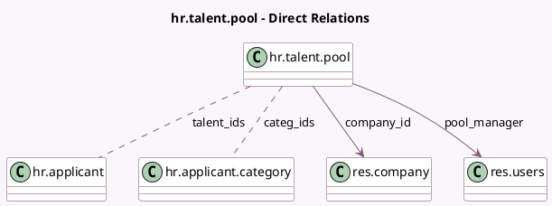

<!-- GENERATED:MODEL -->
---
tags: [odoo, community, generated, model]
---

# hr.talent.pool

- Module: [[docs/Community Addons/hr_recruitment/hr_recruitment|hr_recruitment]]
- Scope: Community Addons
- Defined in module: yes
- Source files: `models/hr_talent_pool.py`
- Python classes: `HrTalentPool`
- Description: Talent Pool
- Inherits: `mail.thread`

## Field footprint

- Detected fields: 9
- Field types: `Boolean` x 1, `Char` x 1, `Html` x 1, `Integer` x 2, `Many2many` x 2, `Many2one` x 2
- Relation fields: 4

## Sample fields

- `active`: `Boolean`
- `categ_ids`: `Many2many` (comodel `hr.applicant.category`, store `True`)
- `color`: `Integer`
- `company_id`: `Many2one` (comodel `res.company`)
- `description`: `Html`
- `name`: `Char`
- `no_of_talents`: `Integer` (compute `_compute_talent_count`)
- `pool_manager`: `Many2one` (comodel `res.users`, store `True`)
- `talent_ids`: `Many2many` (comodel `hr.applicant`)

## Method hints

- Detected methods: 3
- Action methods: `action_talent_pool_add_talents`
- Compute methods: `_compute_talent_count`
- Onchange methods: none

## Direct relation diagram

## Navigation

- **Parent:** [[docs/Community Addons/hr_recruitment/Models]]

<!-- GENERATED:MODEL -->
