<!-- GENERATED:MODEL -->
---
tags: [odoo, community, generated, model]
---

# job.add.applicants

- Module: [[docs/Community Addons/hr_recruitment/hr_recruitment|hr_recruitment]]
- Scope: Community Addons
- Defined in module: yes
- Source files: `wizard/job_add_applicants.py`
- Python classes: `JobAddApplicants`
- Description: Add applicants to a job

## Field footprint

- Detected fields: 2
- Field types: `Many2many` x 2
- Relation fields: 2

## Sample fields

- `applicant_ids`: `Many2many` (comodel `hr.applicant`)
- `job_ids`: `Many2many` (comodel `hr.job`)

## Method hints

- Detected methods: 2
- Action methods: `action_add_applicants_to_job`
- Compute methods: none
- Onchange methods: none

## Direct relation diagram

```plantuml
@startuml
!define ODOO_COLOR_PRIMARY #714B67
!define ODOO_COLOR_ACCENT #875A7B
!define ODOO_COLOR_BG #FAF7FA

skinparam backgroundColor ODOO_COLOR_BG
skinparam defaultTextAlignment left
skinparam ArrowColor ODOO_COLOR_ACCENT
skinparam ClassBackgroundColor white
skinparam ClassBorderColor ODOO_COLOR_PRIMARY
skinparam ComponentBackgroundColor white
skinparam ComponentBorderColor ODOO_COLOR_PRIMARY
skinparam NoteBackgroundColor #FFF8FF
skinparam NoteBorderColor ODOO_COLOR_ACCENT
skinparam SequenceLifeLineBorderColor ODOO_COLOR_ACCENT
skinparam SequenceLifeLineBackgroundColor #FFFFFF
skinparam SequenceParticipantBorderColor ODOO_COLOR_PRIMARY
skinparam SequenceParticipantBackgroundColor #FFFFFF
skinparam sequence {
  ArrowColor ODOO_COLOR_ACCENT
  ActorBorderColor ODOO_COLOR_PRIMARY
}
title job.add.applicants - Direct Relations
class "job.add.applicants" as job_add_applicants
class "hr.applicant" as hr_applicant
class "hr.job" as hr_job
job_add_applicants .. hr_applicant : applicant_ids
job_add_applicants .. hr_job : job_ids
@enduml
```

## Navigation

- **Parent:** [[docs/Community Addons/hr_recruitment/Models]]

<!-- GENERATED:MODEL -->
