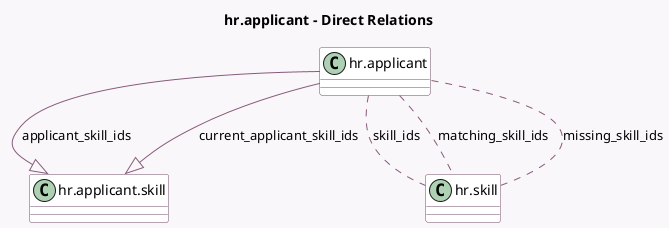

<!-- GENERATED:MODEL -->
---
tags: [odoo, community, generated, model]
---

# hr.applicant

- Module: [[docs/Community Addons/hr_recruitment_skills/hr_recruitment_skills|hr_recruitment_skills]]
- Scope: Community Addons
- Defined in module: extension only
- Source files: `models/hr_applicant.py`
- Python classes: `HrApplicant`

## Field footprint

- Detected fields: 6
- Field types: `Integer` x 1, `Many2many` x 3, `One2many` x 2
- Relation fields: 5

## Sample fields

- `applicant_skill_ids`: `One2many` (comodel `hr.applicant.skill`)
- `current_applicant_skill_ids`: `One2many` (comodel `hr.applicant.skill`, compute `_compute_current_applicant_skill_ids`)
- `matching_score`: `Integer` (compute `_compute_matching_skill_ids`)
- `matching_skill_ids`: `Many2many` (comodel `hr.skill`, compute `_compute_matching_skill_ids`)
- `missing_skill_ids`: `Many2many` (comodel `hr.skill`, compute `_compute_matching_skill_ids`)
- `skill_ids`: `Many2many` (comodel `hr.skill`, compute `_compute_skill_ids`, store `True`)

## Method hints

- Detected methods: 8
- Action methods: `action_add_to_job`
- Compute methods: `_compute_current_applicant_skill_ids`, `_compute_matching_skill_ids`, `_compute_skill_ids`
- Onchange methods: none

## Direct relation diagram

## Navigation

- **Parent:** [[docs/Community Addons/hr_recruitment_skills/Models]]

<!-- GENERATED:MODEL -->
