<!-- GENERATED:MODEL -->
---
tags: [odoo, community, generated, model]
---

# hr.applicant

- Module: [[docs/Community Addons/hr_recruitment_survey/hr_recruitment_survey|hr_recruitment_survey]]
- Scope: Community Addons
- Defined in module: extension only
- Source files: `models/hr_applicant.py`
- Python classes: `HrApplicant`

## Field footprint

- Detected fields: 2
- Field types: `Many2one` x 1, `One2many` x 1
- Relation fields: 2

## Sample fields

- `response_ids`: `One2many` (comodel `survey.user_input`)
- `survey_id`: `Many2one` (comodel `survey.survey`, related `job_id.survey_id`)

## Method hints

- Detected methods: 2
- Action methods: `action_print_survey`, `action_send_survey`
- Compute methods: none
- Onchange methods: none

## Direct relation diagram

```plantuml
@startuml
!define ODOO_COLOR_PRIMARY #714B67
!define ODOO_COLOR_ACCENT #875A7B
!define ODOO_COLOR_BG #FAF7FA

skinparam backgroundColor ODOO_COLOR_BG
skinparam defaultTextAlignment left
skinparam ArrowColor ODOO_COLOR_ACCENT
skinparam ClassBackgroundColor white
skinparam ClassBorderColor ODOO_COLOR_PRIMARY
skinparam ComponentBackgroundColor white
skinparam ComponentBorderColor ODOO_COLOR_PRIMARY
skinparam NoteBackgroundColor #FFF8FF
skinparam NoteBorderColor ODOO_COLOR_ACCENT
skinparam SequenceLifeLineBorderColor ODOO_COLOR_ACCENT
skinparam SequenceLifeLineBackgroundColor #FFFFFF
skinparam SequenceParticipantBorderColor ODOO_COLOR_PRIMARY
skinparam SequenceParticipantBackgroundColor #FFFFFF
skinparam sequence {
  ArrowColor ODOO_COLOR_ACCENT
  ActorBorderColor ODOO_COLOR_PRIMARY
}
title hr.applicant - Direct Relations
class "hr.applicant" as hr_applicant
class "survey.survey" as survey_survey
class "survey.user_input" as survey_user_input
hr_applicant --> survey_survey : survey_id
hr_applicant --|> survey_user_input : response_ids
@enduml
```

## Navigation

- **Parent:** [[docs/Community Addons/hr_recruitment_survey/Models]]

<!-- GENERATED:MODEL -->
