<!-- GENERATED:MODEL -->
---
tags: [odoo, community, generated, model]
---

# hr.employee.cv.wizard

- Module: [[docs/Community Addons/hr_skills/hr_skills|hr_skills]]
- Scope: Community Addons
- Defined in module: yes
- Source files: `wizard/hr_employee_cv_wizard.py`
- Python classes: `HrEmployeeCvWizard`
- Description: Print Resume

## Field footprint

- Detected fields: 8
- Field types: `Boolean` x 5, `Char` x 2, `Many2many` x 1
- Relation fields: 1

## Sample fields

- `can_show_others`: `Boolean` (compute `_compute_can_show_others`)
- `can_show_skills`: `Boolean` (compute `_compute_can_show_others`)
- `color_primary`: `Char` (comodel `Primary Color`)
- `color_secondary`: `Char` (comodel `Secondary Color`)
- `employee_ids`: `Many2many` (comodel `hr.employee`)
- `show_contact`: `Boolean`
- `show_others`: `Boolean`
- `show_skills`: `Boolean`

## Method hints

- Detected methods: 2
- Action methods: `action_validate`
- Compute methods: `_compute_can_show_others`
- Onchange methods: none

## Direct relation diagram

```plantuml
@startuml
!define ODOO_COLOR_PRIMARY #714B67
!define ODOO_COLOR_ACCENT #875A7B
!define ODOO_COLOR_BG #FAF7FA

skinparam backgroundColor ODOO_COLOR_BG
skinparam defaultTextAlignment left
skinparam ArrowColor ODOO_COLOR_ACCENT
skinparam ClassBackgroundColor white
skinparam ClassBorderColor ODOO_COLOR_PRIMARY
skinparam ComponentBackgroundColor white
skinparam ComponentBorderColor ODOO_COLOR_PRIMARY
skinparam NoteBackgroundColor #FFF8FF
skinparam NoteBorderColor ODOO_COLOR_ACCENT
skinparam SequenceLifeLineBorderColor ODOO_COLOR_ACCENT
skinparam SequenceLifeLineBackgroundColor #FFFFFF
skinparam SequenceParticipantBorderColor ODOO_COLOR_PRIMARY
skinparam SequenceParticipantBackgroundColor #FFFFFF
skinparam sequence {
  ArrowColor ODOO_COLOR_ACCENT
  ActorBorderColor ODOO_COLOR_PRIMARY
}
title hr.employee.cv.wizard - Direct Relations
class "hr.employee.cv.wizard" as hr_employee_cv_wizard
class "hr.employee" as hr_employee
hr_employee_cv_wizard .. hr_employee : employee_ids
@enduml
```

## Navigation

- **Parent:** [[docs/Community Addons/hr_skills/Models]]

<!-- GENERATED:MODEL -->
