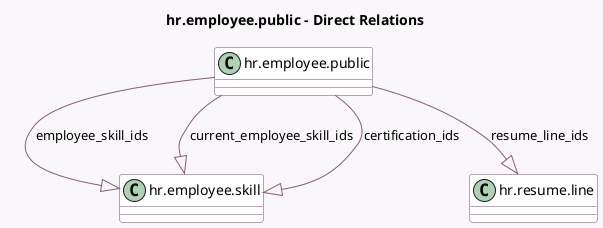

<!-- GENERATED:MODEL -->
---
tags: [odoo, community, generated, model]
---

# hr.employee.public

- Module: [[docs/Community Addons/hr_skills/hr_skills|hr_skills]]
- Scope: Community Addons
- Defined in module: extension only
- Source files: `models/hr_employee_public.py`
- Python classes: `HrEmployeePublic`

## Field footprint

- Detected fields: 4
- Field types: `One2many` x 4
- Relation fields: 4

## Sample fields

- `certification_ids`: `One2many` (comodel `hr.employee.skill`, related `employee_id.certification_ids`)
- `current_employee_skill_ids`: `One2many` (comodel `hr.employee.skill`, related `employee_id.current_employee_skill_ids`)
- `employee_skill_ids`: `One2many` (comodel `hr.employee.skill`)
- `resume_line_ids`: `One2many` (comodel `hr.resume.line`)

## Method hints

- Detected methods: 0
- Action methods: none
- Compute methods: none
- Onchange methods: none

## Direct relation diagram

## Navigation

- **Parent:** [[docs/Community Addons/hr_skills/Models]]

<!-- GENERATED:MODEL -->
