<!-- GENERATED:MODEL -->
---
tags: [odoo, community, generated, model]
---

# hr.individual.skill.mixin

- Module: [[docs/Community Addons/hr_skills/hr_skills|hr_skills]]
- Scope: Community Addons
- Defined in module: yes
- Source files: `models/hr_individual_skill_mixin.py`
- Python classes: `HrIndividualSkillMixin`
- Description: Skill level

## Field footprint

- Detected fields: 11
- Field types: `Boolean` x 2, `Date` x 2, `Integer` x 4, `Many2one` x 3
- Relation fields: 3

## Sample fields

- `certification_skill_type_count`: `Integer` (compute `_compute_certification_skill_type_count`)
- `color`: `Integer` (related `skill_type_id.color`)
- `display_warning_message`: `Boolean`
- `is_certification`: `Boolean` (related `skill_type_id.is_certification`)
- `level_progress`: `Integer` (related `skill_level_id.level_progress`)
- `levels_count`: `Integer` (related `skill_type_id.levels_count`)
- `skill_id`: `Many2one` (comodel `hr.skill`, compute `_compute_skill_id`, store `True`)
- `skill_level_id`: `Many2one` (comodel `hr.skill.level`, compute `_compute_skill_level_id`, store `True`)
- `skill_type_id`: `Many2one` (comodel `hr.skill.type`)
- `valid_from`: `Date`
- `valid_to`: `Date`

## Method hints

- Detected methods: 19
- Action methods: none
- Compute methods: `_compute_certification_skill_type_count`, `_compute_display_name`, `_compute_skill_id`, `_compute_skill_level_id`
- Onchange methods: `_onchange_is_certification`, `_onchange_valid_date`

## Direct relation diagram

```plantuml
@startuml
!define ODOO_COLOR_PRIMARY #714B67
!define ODOO_COLOR_ACCENT #875A7B
!define ODOO_COLOR_BG #FAF7FA

skinparam backgroundColor ODOO_COLOR_BG
skinparam defaultTextAlignment left
skinparam ArrowColor ODOO_COLOR_ACCENT
skinparam ClassBackgroundColor white
skinparam ClassBorderColor ODOO_COLOR_PRIMARY
skinparam ComponentBackgroundColor white
skinparam ComponentBorderColor ODOO_COLOR_PRIMARY
skinparam NoteBackgroundColor #FFF8FF
skinparam NoteBorderColor ODOO_COLOR_ACCENT
skinparam SequenceLifeLineBorderColor ODOO_COLOR_ACCENT
skinparam SequenceLifeLineBackgroundColor #FFFFFF
skinparam SequenceParticipantBorderColor ODOO_COLOR_PRIMARY
skinparam SequenceParticipantBackgroundColor #FFFFFF
skinparam sequence {
  ArrowColor ODOO_COLOR_ACCENT
  ActorBorderColor ODOO_COLOR_PRIMARY
}
title hr.individual.skill.mixin - Direct Relations
class "hr.individual.skill.mixin" as hr_individual_skill_mixin
class "hr.skill" as hr_skill
class "hr.skill.level" as hr_skill_level
class "hr.skill.type" as hr_skill_type
hr_individual_skill_mixin --> hr_skill : skill_id
hr_individual_skill_mixin --> hr_skill_level : skill_level_id
hr_individual_skill_mixin --> hr_skill_type : skill_type_id
@enduml
```

## Navigation

- **Parent:** [[docs/Community Addons/hr_skills/Models]]

<!-- GENERATED:MODEL -->
