<!-- GENERATED:MODEL -->
---
tags: [odoo, community, generated, model]
---

# hr.job

- Module: [[docs/Community Addons/hr_skills/hr_skills|hr_skills]]
- Scope: Community Addons
- Defined in module: extension only
- Source files: `models/hr_job.py`
- Python classes: `HrJob`

## Field footprint

- Detected fields: 3
- Field types: `Many2many` x 1, `One2many` x 2
- Relation fields: 3

## Sample fields

- `current_job_skill_ids`: `One2many` (comodel `hr.job.skill`, compute `_compute_current_job_skill_ids`)
- `job_skill_ids`: `One2many` (comodel `hr.job.skill`)
- `skill_ids`: `Many2many` (comodel `hr.skill`, compute `_compute_skill_ids`, store `True`)

## Method hints

- Detected methods: 5
- Action methods: none
- Compute methods: `_compute_current_job_skill_ids`, `_compute_skill_ids`
- Onchange methods: none

## Direct relation diagram

```plantuml
@startuml
!define ODOO_COLOR_PRIMARY #714B67
!define ODOO_COLOR_ACCENT #875A7B
!define ODOO_COLOR_BG #FAF7FA

skinparam backgroundColor ODOO_COLOR_BG
skinparam defaultTextAlignment left
skinparam ArrowColor ODOO_COLOR_ACCENT
skinparam ClassBackgroundColor white
skinparam ClassBorderColor ODOO_COLOR_PRIMARY
skinparam ComponentBackgroundColor white
skinparam ComponentBorderColor ODOO_COLOR_PRIMARY
skinparam NoteBackgroundColor #FFF8FF
skinparam NoteBorderColor ODOO_COLOR_ACCENT
skinparam SequenceLifeLineBorderColor ODOO_COLOR_ACCENT
skinparam SequenceLifeLineBackgroundColor #FFFFFF
skinparam SequenceParticipantBorderColor ODOO_COLOR_PRIMARY
skinparam SequenceParticipantBackgroundColor #FFFFFF
skinparam sequence {
  ArrowColor ODOO_COLOR_ACCENT
  ActorBorderColor ODOO_COLOR_PRIMARY
}
title hr.job - Direct Relations
class "hr.job" as hr_job
class "hr.job.skill" as hr_job_skill
class "hr.skill" as hr_skill
hr_job --|> hr_job_skill : job_skill_ids
hr_job --|> hr_job_skill : current_job_skill_ids
hr_job .. hr_skill : skill_ids
@enduml
```

## Navigation

- **Parent:** [[docs/Community Addons/hr_skills/Models]]

<!-- GENERATED:MODEL -->
