<!-- GENERATED:MODEL -->
---
tags: [odoo, community, generated, model]
---

# hr.resume.line

- Module: [[docs/Community Addons/hr_skills/hr_skills|hr_skills]]
- Scope: Community Addons
- Defined in module: yes
- Source files: `models/hr_resume_line.py`
- Python classes: `HrResumeLine`
- Description: Resume line of an employee

## Field footprint

- Detected fields: 17
- Field types: `Binary` x 1, `Boolean` x 1, `Char` x 4, `Date` x 2, `Html` x 1, `Image` x 1, `Integer` x 1, `Many2one` x 4, `Properties` x 1, `Selection` x 1
- Relation fields: 4

## Sample fields

- `avatar_128`: `Image` (related `employee_id.avatar_128`)
- `certificate_file`: `Binary`
- `certificate_filename`: `Char`
- `color`: `Char` (compute `_compute_color`)
- `company_id`: `Many2one` (related `employee_id.company_id`)
- `course_type`: `Selection`
- `date_end`: `Date`
- `date_start`: `Date`
- `department_id`: `Many2one` (related `employee_id.department_id`)
- `description`: `Html`
- `duration`: `Integer`
- `employee_id`: `Many2one` (comodel `hr.employee`)
- `external_url`: `Char` (compute `_compute_external_url`, store `True`)
- `is_course`: `Boolean` (related `line_type_id.is_course`)
- `line_type_id`: `Many2one` (comodel `hr.resume.line.type`)
- `name`: `Char`
- `resume_line_properties`: `Properties` (comodel `Properties`)

## Method hints

- Detected methods: 3
- Action methods: none
- Compute methods: `_compute_color`, `_compute_external_url`
- Onchange methods: `_onchange_external_url`

## Direct relation diagram

```plantuml
@startuml
!define ODOO_COLOR_PRIMARY #714B67
!define ODOO_COLOR_ACCENT #875A7B
!define ODOO_COLOR_BG #FAF7FA

skinparam backgroundColor ODOO_COLOR_BG
skinparam defaultTextAlignment left
skinparam ArrowColor ODOO_COLOR_ACCENT
skinparam ClassBackgroundColor white
skinparam ClassBorderColor ODOO_COLOR_PRIMARY
skinparam ComponentBackgroundColor white
skinparam ComponentBorderColor ODOO_COLOR_PRIMARY
skinparam NoteBackgroundColor #FFF8FF
skinparam NoteBorderColor ODOO_COLOR_ACCENT
skinparam SequenceLifeLineBorderColor ODOO_COLOR_ACCENT
skinparam SequenceLifeLineBackgroundColor #FFFFFF
skinparam SequenceParticipantBorderColor ODOO_COLOR_PRIMARY
skinparam SequenceParticipantBackgroundColor #FFFFFF
skinparam sequence {
  ArrowColor ODOO_COLOR_ACCENT
  ActorBorderColor ODOO_COLOR_PRIMARY
}
title hr.resume.line - Direct Relations
class "hr.resume.line" as hr_resume_line
class "hr.employee" as hr_employee
class "hr.resume.line.type" as hr_resume_line_type
hr_resume_line --> hr_employee : employee_id
hr_resume_line --> hr_resume_line_type : line_type_id
@enduml
```

## Navigation

- **Parent:** [[docs/Community Addons/hr_skills/Models]]

<!-- GENERATED:MODEL -->
