<!-- GENERATED:MODEL -->
---
tags: [odoo, community, generated, model]
---

# hr.skill.level

- Module: [[docs/Community Addons/hr_skills/hr_skills|hr_skills]]
- Scope: Community Addons
- Defined in module: yes
- Source files: `models/hr_skill_level.py`
- Python classes: `HrSkillLevel`
- Description: Skill Level

## Field footprint

- Detected fields: 5
- Field types: `Boolean` x 2, `Char` x 1, `Integer` x 1, `Many2one` x 1
- Relation fields: 1

## Sample fields

- `default_level`: `Boolean`
- `level_progress`: `Integer`
- `name`: `Char`
- `skill_type_id`: `Many2one` (comodel `hr.skill.type`)
- `technical_is_new_default`: `Boolean` (compute `_compute_technical_is_new_default`)

## Method hints

- Detected methods: 3
- Action methods: none
- Compute methods: `_compute_technical_is_new_default`
- Onchange methods: none

## Direct relation diagram

```plantuml
@startuml
!define ODOO_COLOR_PRIMARY #714B67
!define ODOO_COLOR_ACCENT #875A7B
!define ODOO_COLOR_BG #FAF7FA

skinparam backgroundColor ODOO_COLOR_BG
skinparam defaultTextAlignment left
skinparam ArrowColor ODOO_COLOR_ACCENT
skinparam ClassBackgroundColor white
skinparam ClassBorderColor ODOO_COLOR_PRIMARY
skinparam ComponentBackgroundColor white
skinparam ComponentBorderColor ODOO_COLOR_PRIMARY
skinparam NoteBackgroundColor #FFF8FF
skinparam NoteBorderColor ODOO_COLOR_ACCENT
skinparam SequenceLifeLineBorderColor ODOO_COLOR_ACCENT
skinparam SequenceLifeLineBackgroundColor #FFFFFF
skinparam SequenceParticipantBorderColor ODOO_COLOR_PRIMARY
skinparam SequenceParticipantBackgroundColor #FFFFFF
skinparam sequence {
  ArrowColor ODOO_COLOR_ACCENT
  ActorBorderColor ODOO_COLOR_PRIMARY
}
title hr.skill.level - Direct Relations
class "hr.skill.level" as hr_skill_level
class "hr.skill.type" as hr_skill_type
hr_skill_level --> hr_skill_type : skill_type_id
@enduml
```

## Navigation

- **Parent:** [[docs/Community Addons/hr_skills/Models]]

<!-- GENERATED:MODEL -->
