<!-- GENERATED:MODEL -->
---
tags: [odoo, community, generated, model]
---

# hr.skill.type

- Module: [[docs/Community Addons/hr_skills/hr_skills|hr_skills]]
- Scope: Community Addons
- Defined in module: yes
- Source files: `models/hr_skill_type.py`
- Python classes: `HrSkillType`
- Description: Skill Type

## Field footprint

- Detected fields: 8
- Field types: `Boolean` x 2, `Char` x 1, `Integer` x 3, `One2many` x 2
- Relation fields: 2

## Sample fields

- `active`: `Boolean` (comodel `Active`)
- `color`: `Integer` (comodel `Color`)
- `is_certification`: `Boolean` (comodel `Certification`)
- `levels_count`: `Integer` (compute `_compute_levels_count`, store `True`)
- `name`: `Char`
- `sequence`: `Integer` (comodel `Sequence`)
- `skill_ids`: `One2many` (comodel `hr.skill`)
- `skill_level_ids`: `One2many` (comodel `hr.skill.level`)

## Method hints

- Detected methods: 6
- Action methods: none
- Compute methods: `_compute_display_name`, `_compute_levels_count`
- Onchange methods: `_onchange_skill_level_ids`

## Direct relation diagram

```plantuml
@startuml
!define ODOO_COLOR_PRIMARY #714B67
!define ODOO_COLOR_ACCENT #875A7B
!define ODOO_COLOR_BG #FAF7FA

skinparam backgroundColor ODOO_COLOR_BG
skinparam defaultTextAlignment left
skinparam ArrowColor ODOO_COLOR_ACCENT
skinparam ClassBackgroundColor white
skinparam ClassBorderColor ODOO_COLOR_PRIMARY
skinparam ComponentBackgroundColor white
skinparam ComponentBorderColor ODOO_COLOR_PRIMARY
skinparam NoteBackgroundColor #FFF8FF
skinparam NoteBorderColor ODOO_COLOR_ACCENT
skinparam SequenceLifeLineBorderColor ODOO_COLOR_ACCENT
skinparam SequenceLifeLineBackgroundColor #FFFFFF
skinparam SequenceParticipantBorderColor ODOO_COLOR_PRIMARY
skinparam SequenceParticipantBackgroundColor #FFFFFF
skinparam sequence {
  ArrowColor ODOO_COLOR_ACCENT
  ActorBorderColor ODOO_COLOR_PRIMARY
}
title hr.skill.type - Direct Relations
class "hr.skill.type" as hr_skill_type
class "hr.skill" as hr_skill
class "hr.skill.level" as hr_skill_level
hr_skill_type --|> hr_skill : skill_ids
hr_skill_type --|> hr_skill_level : skill_level_ids
@enduml
```

## Navigation

- **Parent:** [[docs/Community Addons/hr_skills/Models]]

<!-- GENERATED:MODEL -->
