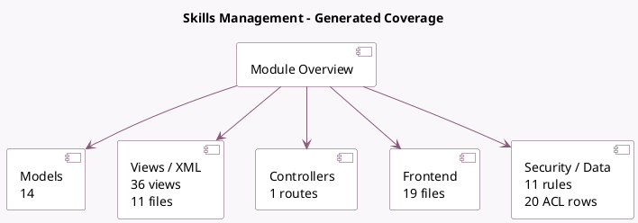

<!-- GENERATED:MODULE -->
---
tags: [odoo, community, module]
---

# Skills Management

- Scope: Community Addons
- Source: odoo/addons/hr_skills
- Dependencies: [[docs/Community Addons/hr/hr|hr]]

## Summary

Manage skills, knowledge and resume of your employees

## Generated coverage

- Models: 14
- XML files with UI/data artifacts: 11
- Views: 36
- Actions: 11
- Menus: 9
- Rules (ir.rule): 11
- Access CSV entries: 20
- Controller units: 1
- Frontend asset files: 19

## Module map

## Detail notes

- Models: [[docs/Community Addons/hr_skills/Models|Models]] (14)
- Views and XML: [[docs/Community Addons/hr_skills/Views|Views]] (11 files)
- Controllers: [[docs/Community Addons/hr_skills/Controllers|Controllers]] (1)
- Frontend: [[docs/Community Addons/hr_skills/Frontend|Frontend]] (19 files)

## Key models

- `hr.employee`
- `hr.employee.cv.wizard`
- `hr.employee.public`
- `hr.employee.skill`
- `hr.individual.skill.mixin`
- `hr.job`
- `hr.job.skill`
- `hr.resume.line`
- `hr.resume.line.type`
- `hr.skill`
- `hr.skill.level`
- `hr.skill.type`

## Navigation

- [[../Community Addons/Community Addons|Back to scope]]
- [[../../docs/docs|Back to docs]]

<!-- GENERATED:MODULE -->

