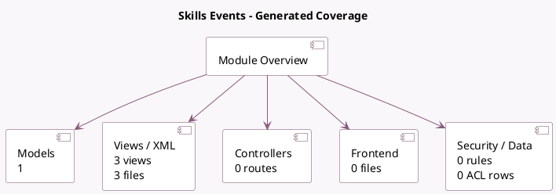

<!-- GENERATED:MODULE -->
---
tags: [odoo, community, module]
---

# Skills Events

- Scope: Community Addons
- Source: odoo/addons/hr_skills_event
- Dependencies: [[docs/Community Addons/hr_skills/hr_skills|hr_skills]], [[docs/Community Addons/event/event|event]]

## Summary

Link training events to resume of your employees

## Generated coverage

- Models: 1
- XML files with UI/data artifacts: 3
- Views: 3
- Actions: 1
- Menus: 2
- Rules (ir.rule): 0
- Access CSV entries: 0
- Controller units: 0
- Frontend asset files: 0

## Module map

## Detail notes

- Models: [[docs/Community Addons/hr_skills_event/Models|Models]] (1)
- Views and XML: [[docs/Community Addons/hr_skills_event/Views|Views]] (3 files)

## Key models

- `hr.resume.line`

## Navigation

- [[../Community Addons/Community Addons|Back to scope]]
- [[../../docs/docs|Back to docs]]

<!-- GENERATED:MODULE -->

