<!-- GENERATED:MODEL -->
---
tags: [odoo, community, generated, model]
---

# hr.employee

- Module: [[docs/Community Addons/hr_skills_slides/hr_skills_slides|hr_skills_slides]]
- Scope: Community Addons
- Defined in module: extension only
- Source files: `models/hr_employee.py`
- Python classes: `HrEmployee`

## Field footprint

- Detected fields: 3
- Field types: `Boolean` x 1, `Char` x 1, `Many2many` x 1
- Relation fields: 1

## Sample fields

- `courses_completion_text`: `Char` (compute `_compute_courses_completion_text`)
- `has_subscribed_courses`: `Boolean` (compute `_compute_courses_completion_text`)
- `subscribed_courses`: `Many2many` (comodel `slide.channel`, related `user_partner_id.slide_channel_ids`)

## Method hints

- Detected methods: 2
- Action methods: `action_open_courses`
- Compute methods: `_compute_courses_completion_text`
- Onchange methods: none

## Direct relation diagram

```plantuml
@startuml
!define ODOO_COLOR_PRIMARY #714B67
!define ODOO_COLOR_ACCENT #875A7B
!define ODOO_COLOR_BG #FAF7FA

skinparam backgroundColor ODOO_COLOR_BG
skinparam defaultTextAlignment left
skinparam ArrowColor ODOO_COLOR_ACCENT
skinparam ClassBackgroundColor white
skinparam ClassBorderColor ODOO_COLOR_PRIMARY
skinparam ComponentBackgroundColor white
skinparam ComponentBorderColor ODOO_COLOR_PRIMARY
skinparam NoteBackgroundColor #FFF8FF
skinparam NoteBorderColor ODOO_COLOR_ACCENT
skinparam SequenceLifeLineBorderColor ODOO_COLOR_ACCENT
skinparam SequenceLifeLineBackgroundColor #FFFFFF
skinparam SequenceParticipantBorderColor ODOO_COLOR_PRIMARY
skinparam SequenceParticipantBackgroundColor #FFFFFF
skinparam sequence {
  ArrowColor ODOO_COLOR_ACCENT
  ActorBorderColor ODOO_COLOR_PRIMARY
}
title hr.employee - Direct Relations
class "hr.employee" as hr_employee
class "slide.channel" as slide_channel
hr_employee .. slide_channel : subscribed_courses
@enduml
```

## Navigation

- **Parent:** [[docs/Community Addons/hr_skills_slides/Models]]

<!-- GENERATED:MODEL -->
