<!-- GENERATED:MODEL -->
---
tags: [odoo, community, generated, model]
---

# hr.resume.line

- Module: [[docs/Community Addons/hr_skills_slides/hr_skills_slides|hr_skills_slides]]
- Scope: Community Addons
- Defined in module: extension only
- Source files: `models/hr_resume_line.py`
- Python classes: `HrResumeLine`

## Field footprint

- Detected fields: 4
- Field types: `Char` x 1, `Integer` x 1, `Many2one` x 1, `Selection` x 1
- Relation fields: 1

## Sample fields

- `channel_id`: `Many2one` (comodel `slide.channel`, compute `_compute_channel_id`, store `True`)
- `course_type`: `Selection`
- `course_url`: `Char` (related `channel_id.website_absolute_url`)
- `duration`: `Integer` (compute `_compute_duration`, store `True`)

## Method hints

- Detected methods: 4
- Action methods: none
- Compute methods: `_compute_channel_id`, `_compute_color`, `_compute_duration`
- Onchange methods: `_onchange_channel_id`

## Direct relation diagram

```plantuml
@startuml
!define ODOO_COLOR_PRIMARY #714B67
!define ODOO_COLOR_ACCENT #875A7B
!define ODOO_COLOR_BG #FAF7FA

skinparam backgroundColor ODOO_COLOR_BG
skinparam defaultTextAlignment left
skinparam ArrowColor ODOO_COLOR_ACCENT
skinparam ClassBackgroundColor white
skinparam ClassBorderColor ODOO_COLOR_PRIMARY
skinparam ComponentBackgroundColor white
skinparam ComponentBorderColor ODOO_COLOR_PRIMARY
skinparam NoteBackgroundColor #FFF8FF
skinparam NoteBorderColor ODOO_COLOR_ACCENT
skinparam SequenceLifeLineBorderColor ODOO_COLOR_ACCENT
skinparam SequenceLifeLineBackgroundColor #FFFFFF
skinparam SequenceParticipantBorderColor ODOO_COLOR_PRIMARY
skinparam SequenceParticipantBackgroundColor #FFFFFF
skinparam sequence {
  ArrowColor ODOO_COLOR_ACCENT
  ActorBorderColor ODOO_COLOR_PRIMARY
}
title hr.resume.line - Direct Relations
class "hr.resume.line" as hr_resume_line
class "slide.channel" as slide_channel
hr_resume_line --> slide_channel : channel_id
@enduml
```

## Navigation

- **Parent:** [[docs/Community Addons/hr_skills_slides/Models]]

<!-- GENERATED:MODEL -->
