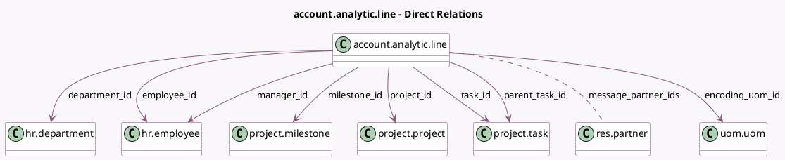

<!-- GENERATED:MODEL -->
---
tags: [odoo, community, generated, model]
---

# account.analytic.line

- Module: [[docs/Community Addons/hr_timesheet/hr_timesheet|hr_timesheet]]
- Scope: Community Addons
- Defined in module: extension only
- Source files: `models/hr_timesheet.py`
- Python classes: `AccountAnalyticLine`

## Field footprint

- Detected fields: 14
- Field types: `Boolean` x 1, `Char` x 2, `Many2many` x 1, `Many2one` x 10
- Relation fields: 11

## Sample fields

- `calendar_display_name`: `Char` (compute `_compute_calendar_display_name`)
- `department_id`: `Many2one` (comodel `hr.department`, compute `_compute_department_id`, store `True`)
- `employee_id`: `Many2one` (comodel `hr.employee`)
- `encoding_uom_id`: `Many2one` (comodel `uom.uom`, compute `_compute_encoding_uom_id`)
- `job_title`: `Char` (related `employee_id.job_title`)
- `manager_id`: `Many2one` (comodel `hr.employee`, related `employee_id.parent_id`, store `True`)
- `message_partner_ids`: `Many2many` (comodel `res.partner`, compute `_compute_message_partner_ids`)
- `milestone_id`: `Many2one` (comodel `project.milestone`, related `task_id.milestone_id`)
- `parent_task_id`: `Many2one` (comodel `project.task`, related `task_id.parent_id`, store `True`)
- `partner_id`: `Many2one` (compute `_compute_partner_id`, store `True`)
- `project_id`: `Many2one` (comodel `project.project`, compute `_compute_project_id`, store `True`)
- `readonly_timesheet`: `Boolean` (compute `_compute_readonly_timesheet`)
- `task_id`: `Many2one` (comodel `project.task`, compute `_compute_task_id`, store `True`)
- `user_id`: `Many2one` (compute `_compute_user_id`, store `True`)

## Method hints

- Detected methods: 40
- Action methods: `action_open_timesheet_view_portal`
- Compute methods: `_compute_calendar_display_name`, `_compute_department_id`, `_compute_display_name`, `_compute_encoding_uom_id`, `_compute_message_partner_ids`, `_compute_partner_id`, `_compute_project_id`, `_compute_readonly_timesheet`, and 2 more
- Onchange methods: `_onchange_project_id`

## Direct relation diagram

## Navigation

- **Parent:** [[docs/Community Addons/hr_timesheet/Models]]

<!-- GENERATED:MODEL -->
