<!-- GENERATED:MODEL -->
---
tags: [odoo, community, generated, model]
---

# project.project

- Module: [[docs/Community Addons/hr_timesheet/hr_timesheet|hr_timesheet]]
- Scope: Community Addons
- Defined in module: extension only
- Source files: `models/project_project.py`
- Python classes: `ProjectProject`

## Field footprint

- Detected fields: 12
- Field types: `Boolean` x 5, `Float` x 4, `Many2one` x 2, `One2many` x 1
- Relation fields: 3

## Sample fields

- `account_id`: `Many2one`
- `allocated_hours`: `Float`
- `allow_timesheets`: `Boolean` (comodel `Timesheets`, compute `_compute_allow_timesheets`, store `True`)
- `analytic_account_active`: `Boolean` (comodel `Active Account`, related `account_id.active`)
- `effective_hours`: `Float` (compute `_compute_remaining_hours`)
- `encode_uom_in_days`: `Boolean` (compute `_compute_encode_uom_in_days`)
- `is_internal_project`: `Boolean` (compute `_compute_is_internal_project`)
- `is_project_overtime`: `Boolean` (comodel `Project in Overtime`, compute `_compute_remaining_hours`)
- `remaining_hours`: `Float` (compute `_compute_remaining_hours`)
- `timesheet_encode_uom_id`: `Many2one` (comodel `uom.uom`, compute `_compute_timesheet_encode_uom_id`)
- `timesheet_ids`: `One2many` (comodel `account.analytic.line`)
- `total_timesheet_time`: `Float` (compute `_compute_total_timesheet_time`)

## Method hints

- Detected methods: 20
- Action methods: `action_project_timesheets`, `action_view_tasks`
- Compute methods: `_compute_allow_timesheets`, `_compute_display_name`, `_compute_encode_uom_in_days`, `_compute_is_internal_project`, `_compute_remaining_hours`, `_compute_timesheet_encode_uom_id`, `_compute_total_timesheet_time`
- Onchange methods: none

## Direct relation diagram

```plantuml
@startuml
!define ODOO_COLOR_PRIMARY #714B67
!define ODOO_COLOR_ACCENT #875A7B
!define ODOO_COLOR_BG #FAF7FA

skinparam backgroundColor ODOO_COLOR_BG
skinparam defaultTextAlignment left
skinparam ArrowColor ODOO_COLOR_ACCENT
skinparam ClassBackgroundColor white
skinparam ClassBorderColor ODOO_COLOR_PRIMARY
skinparam ComponentBackgroundColor white
skinparam ComponentBorderColor ODOO_COLOR_PRIMARY
skinparam NoteBackgroundColor #FFF8FF
skinparam NoteBorderColor ODOO_COLOR_ACCENT
skinparam SequenceLifeLineBorderColor ODOO_COLOR_ACCENT
skinparam SequenceLifeLineBackgroundColor #FFFFFF
skinparam SequenceParticipantBorderColor ODOO_COLOR_PRIMARY
skinparam SequenceParticipantBackgroundColor #FFFFFF
skinparam sequence {
  ArrowColor ODOO_COLOR_ACCENT
  ActorBorderColor ODOO_COLOR_PRIMARY
}
title project.project - Direct Relations
class "project.project" as project_project
class "account.analytic.line" as account_analytic_line
class "uom.uom" as uom_uom
project_project --|> account_analytic_line : timesheet_ids
project_project --> uom_uom : timesheet_encode_uom_id
@enduml
```

## Navigation

- **Parent:** [[docs/Community Addons/hr_timesheet/Models]]

<!-- GENERATED:MODEL -->
