<!-- GENERATED:MODEL -->
---
tags: [odoo, community, generated, model]
---

# project.task

- Module: [[docs/Community Addons/hr_timesheet/hr_timesheet|hr_timesheet]]
- Scope: Community Addons
- Defined in module: extension only
- Source files: `models/project_task.py`
- Python classes: `ProjectTask`

## Field footprint

- Detected fields: 13
- Field types: `Boolean` x 3, `Char` x 1, `Float` x 7, `Many2one` x 1, `One2many` x 1
- Relation fields: 2

## Sample fields

- `allow_timesheets`: `Boolean` (comodel `Allow timesheets`, compute `_compute_allow_timesheets`)
- `analytic_account_active`: `Boolean` (comodel `Active Analytic Account`, related `project_id.analytic_account_active`)
- `display_name`: `Char`
- `effective_hours`: `Float` (comodel `Time Spent`, compute `_compute_effective_hours`, store `True`)
- `encode_uom_in_days`: `Boolean` (compute `_compute_encode_uom_in_days`)
- `overtime`: `Float` (compute `_compute_progress_hours`, store `True`)
- `progress`: `Float` (comodel `Progress`, compute `_compute_progress_hours`, store `True`)
- `project_id`: `Many2one`
- `remaining_hours`: `Float` (comodel `Time Remaining`, compute `_compute_remaining_hours`, store `True`)
- `remaining_hours_percentage`: `Float` (compute `_compute_remaining_hours_percentage`)
- `subtask_effective_hours`: `Float` (comodel `Time Spent on Sub-tasks`, compute `_compute_subtask_effective_hours`, store `True`)
- `timesheet_ids`: `One2many` (comodel `account.analytic.line`)
- `total_hours_spent`: `Float` (comodel `Total Time Spent`, compute `_compute_total_hours_spent`, store `True`)

## Method hints

- Detected methods: 25
- Action methods: `action_view_subtask_timesheet`
- Compute methods: `_compute_allow_timesheets`, `_compute_display_name`, `_compute_effective_hours`, `_compute_encode_uom_in_days`, `_compute_progress_hours`, `_compute_remaining_hours`, `_compute_remaining_hours_percentage`, `_compute_subtask_effective_hours`, and 1 more
- Onchange methods: none

## Direct relation diagram

```plantuml
@startuml
!define ODOO_COLOR_PRIMARY #714B67
!define ODOO_COLOR_ACCENT #875A7B
!define ODOO_COLOR_BG #FAF7FA

skinparam backgroundColor ODOO_COLOR_BG
skinparam defaultTextAlignment left
skinparam ArrowColor ODOO_COLOR_ACCENT
skinparam ClassBackgroundColor white
skinparam ClassBorderColor ODOO_COLOR_PRIMARY
skinparam ComponentBackgroundColor white
skinparam ComponentBorderColor ODOO_COLOR_PRIMARY
skinparam NoteBackgroundColor #FFF8FF
skinparam NoteBorderColor ODOO_COLOR_ACCENT
skinparam SequenceLifeLineBorderColor ODOO_COLOR_ACCENT
skinparam SequenceLifeLineBackgroundColor #FFFFFF
skinparam SequenceParticipantBorderColor ODOO_COLOR_PRIMARY
skinparam SequenceParticipantBackgroundColor #FFFFFF
skinparam sequence {
  ArrowColor ODOO_COLOR_ACCENT
  ActorBorderColor ODOO_COLOR_PRIMARY
}
title project.task - Direct Relations
class "project.task" as project_task
class "account.analytic.line" as account_analytic_line
project_task --|> account_analytic_line : timesheet_ids
@enduml
```

## Navigation

- **Parent:** [[docs/Community Addons/hr_timesheet/Models]]

<!-- GENERATED:MODEL -->
