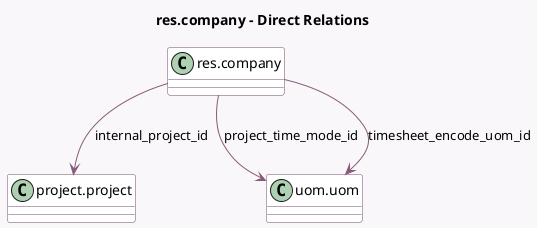

<!-- GENERATED:MODEL -->
---
tags: [odoo, community, generated, model]
---

# res.company

- Module: [[docs/Community Addons/hr_timesheet/hr_timesheet|hr_timesheet]]
- Scope: Community Addons
- Defined in module: extension only
- Source files: `models/res_company.py`
- Python classes: `ResCompany`

## Field footprint

- Detected fields: 3
- Field types: `Many2one` x 3
- Relation fields: 3

## Sample fields

- `internal_project_id`: `Many2one` (comodel `project.project`)
- `project_time_mode_id`: `Many2one` (comodel `uom.uom`)
- `timesheet_encode_uom_id`: `Many2one` (comodel `uom.uom`)

## Method hints

- Detected methods: 5
- Action methods: none
- Compute methods: none
- Onchange methods: none

## Direct relation diagram

## Navigation

- **Parent:** [[docs/Community Addons/hr_timesheet/Models]]

<!-- GENERATED:MODEL -->
