<!-- GENERATED:MODEL -->
---
tags: [odoo, community, generated, model]
---

# res.config.settings

- Module: [[docs/Community Addons/hr_timesheet/hr_timesheet|hr_timesheet]]
- Scope: Community Addons
- Defined in module: extension only
- Source files: `models/res_config_settings.py`
- Python classes: `ResConfigSettings`

## Field footprint

- Detected fields: 6
- Field types: `Boolean` x 4, `Many2one` x 1, `Selection` x 1
- Relation fields: 1

## Sample fields

- `is_encode_uom_days`: `Boolean` (compute `_compute_is_encode_uom_days`)
- `module_project_timesheet_holidays`: `Boolean` (comodel `Time Off`, compute `_compute_timesheet_modules`, store `True`)
- `project_time_mode_id`: `Many2one` (comodel `uom.uom`, related `company_id.project_time_mode_id`)
- `reminder_allow`: `Boolean`
- `reminder_user_allow`: `Boolean`
- `timesheet_encode_method`: `Selection` (compute `_compute_timesheet_encode_method`)

## Method hints

- Detected methods: 4
- Action methods: none
- Compute methods: `_compute_is_encode_uom_days`, `_compute_timesheet_encode_method`, `_compute_timesheet_modules`
- Onchange methods: none

## Direct relation diagram

```plantuml
@startuml
!define ODOO_COLOR_PRIMARY #714B67
!define ODOO_COLOR_ACCENT #875A7B
!define ODOO_COLOR_BG #FAF7FA

skinparam backgroundColor ODOO_COLOR_BG
skinparam defaultTextAlignment left
skinparam ArrowColor ODOO_COLOR_ACCENT
skinparam ClassBackgroundColor white
skinparam ClassBorderColor ODOO_COLOR_PRIMARY
skinparam ComponentBackgroundColor white
skinparam ComponentBorderColor ODOO_COLOR_PRIMARY
skinparam NoteBackgroundColor #FFF8FF
skinparam NoteBorderColor ODOO_COLOR_ACCENT
skinparam SequenceLifeLineBorderColor ODOO_COLOR_ACCENT
skinparam SequenceLifeLineBackgroundColor #FFFFFF
skinparam SequenceParticipantBorderColor ODOO_COLOR_PRIMARY
skinparam SequenceParticipantBackgroundColor #FFFFFF
skinparam sequence {
  ArrowColor ODOO_COLOR_ACCENT
  ActorBorderColor ODOO_COLOR_PRIMARY
}
title res.config.settings - Direct Relations
class "res.config.settings" as res_config_settings
class "uom.uom" as uom_uom
res_config_settings --> uom_uom : project_time_mode_id
@enduml
```

## Navigation

- **Parent:** [[docs/Community Addons/hr_timesheet/Models]]

<!-- GENERATED:MODEL -->
