<!-- GENERATED:MODEL -->
---
tags: [odoo, community, generated, model]
---

# timesheets.analysis.report

- Module: [[docs/Community Addons/hr_timesheet/hr_timesheet|hr_timesheet]]
- Scope: Community Addons
- Defined in module: yes
- Source files: `report/timesheets_analysis_report.py`
- Python classes: `TimesheetsAnalysisReport`
- Description: Timesheets Analysis Report
- Inherits: `hr.manager.department.report`

## Field footprint

- Detected fields: 15
- Field types: `Char` x 1, `Date` x 1, `Float` x 1, `Many2many` x 1, `Many2one` x 10, `Monetary` x 1
- Relation fields: 11

## Sample fields

- `amount`: `Monetary` (comodel `Amount`)
- `company_id`: `Many2one` (comodel `res.company`)
- `currency_id`: `Many2one` (comodel `res.currency`)
- `date`: `Date` (comodel `Date`)
- `department_id`: `Many2one` (comodel `hr.department`)
- `manager_id`: `Many2one` (comodel `hr.employee`)
- `message_partner_ids`: `Many2many` (comodel `res.partner`, compute `_compute_message_partner_ids`)
- `milestone_id`: `Many2one` (comodel `project.milestone`, related `task_id.milestone_id`)
- `name`: `Char` (comodel `Description`)
- `parent_task_id`: `Many2one` (comodel `project.task`)
- `partner_id`: `Many2one` (comodel `res.partner`)
- `project_id`: `Many2one` (comodel `project.project`)
- `task_id`: `Many2one` (comodel `project.task`)
- `unit_amount`: `Float` (comodel `Time Spent`)
- `user_id`: `Many2one` (comodel `res.users`)

## Method hints

- Detected methods: 7
- Action methods: none
- Compute methods: `_compute_message_partner_ids`
- Onchange methods: none

## Direct relation diagram

```plantuml
@startuml
!define ODOO_COLOR_PRIMARY #714B67
!define ODOO_COLOR_ACCENT #875A7B
!define ODOO_COLOR_BG #FAF7FA

skinparam backgroundColor ODOO_COLOR_BG
skinparam defaultTextAlignment left
skinparam ArrowColor ODOO_COLOR_ACCENT
skinparam ClassBackgroundColor white
skinparam ClassBorderColor ODOO_COLOR_PRIMARY
skinparam ComponentBackgroundColor white
skinparam ComponentBorderColor ODOO_COLOR_PRIMARY
skinparam NoteBackgroundColor #FFF8FF
skinparam NoteBorderColor ODOO_COLOR_ACCENT
skinparam SequenceLifeLineBorderColor ODOO_COLOR_ACCENT
skinparam SequenceLifeLineBackgroundColor #FFFFFF
skinparam SequenceParticipantBorderColor ODOO_COLOR_PRIMARY
skinparam SequenceParticipantBackgroundColor #FFFFFF
skinparam sequence {
  ArrowColor ODOO_COLOR_ACCENT
  ActorBorderColor ODOO_COLOR_PRIMARY
}
title timesheets.analysis.report - Direct Relations
class "timesheets.analysis.report" as timesheets_analysis_report
class "hr.department" as hr_department
class "hr.employee" as hr_employee
class "project.milestone" as project_milestone
class "project.project" as project_project
class "project.task" as project_task
class "res.company" as res_company
class "res.currency" as res_currency
class "res.partner" as res_partner
class "res.users" as res_users
timesheets_analysis_report --> res_users : user_id
timesheets_analysis_report --> project_project : project_id
timesheets_analysis_report --> project_task : task_id
timesheets_analysis_report --> project_task : parent_task_id
timesheets_analysis_report --> hr_employee : manager_id
timesheets_analysis_report --> res_company : company_id
timesheets_analysis_report --> hr_department : department_id
timesheets_analysis_report --> res_currency : currency_id
timesheets_analysis_report --> res_partner : partner_id
timesheets_analysis_report --> project_milestone : milestone_id
timesheets_analysis_report .. res_partner : message_partner_ids
@enduml
```

## Navigation

- **Parent:** [[docs/Community Addons/hr_timesheet/Models]]

<!-- GENERATED:MODEL -->
