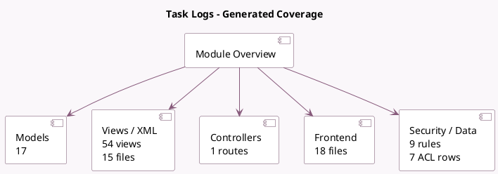

<!-- GENERATED:MODULE -->
---
tags: [odoo, community, module]
---

# Task Logs

- Scope: Community Addons
- Source: odoo/addons/hr_timesheet
- Dependencies: [[docs/Community Addons/hr/hr|hr]], [[docs/Community Addons/hr_hourly_cost/hr_hourly_cost|hr_hourly_cost]], [[docs/Community Addons/analytic/analytic|analytic]], [[docs/Community Addons/project/project|project]], [[docs/Community Addons/uom/uom|uom]]

## Summary

Track employee time on tasks

## Generated coverage

- Models: 17
- XML files with UI/data artifacts: 15
- Views: 54
- Actions: 44
- Menus: 11
- Rules (ir.rule): 9
- Access CSV entries: 7
- Controller units: 1
- Frontend asset files: 18

## Module map

## Detail notes

- Models: [[docs/Community Addons/hr_timesheet/Models|Models]] (17)
- Views and XML: [[docs/Community Addons/hr_timesheet/Views|Views]] (15 files)
- Controllers: [[docs/Community Addons/hr_timesheet/Controllers|Controllers]] (1)
- Frontend: [[docs/Community Addons/hr_timesheet/Frontend|Frontend]] (18 files)

## Key models

- `account.analytic.applicability`
- `account.analytic.line`
- `account.analytic.line.calendar.employee`
- `hr.employee`
- `hr.employee.delete.wizard`
- `hr.employee.public`
- `ir.http`
- `ir.ui.menu`
- `project.collaborator`
- `project.project`
- `project.task`
- `project.update`

## Navigation

- [[../Community Addons/Community Addons|Back to scope]]
- [[../../docs/docs|Back to docs]]

<!-- GENERATED:MODULE -->

