<!-- GENERATED:MODEL -->
---
tags: [odoo, community, generated, model]
---

# hr.timesheet.attendance.report

- Module: [[docs/Community Addons/hr_timesheet_attendance/hr_timesheet_attendance|hr_timesheet_attendance]]
- Scope: Community Addons
- Defined in module: yes
- Source files: `report/hr_timesheet_attendance_report.py`
- Python classes: `HrTimesheetAttendanceReport`
- Description: Timesheet Attendance Report

## Field footprint

- Detected fields: 9
- Field types: `Date` x 1, `Float` x 6, `Many2one` x 2
- Relation fields: 2

## Sample fields

- `attendance_cost`: `Float` (comodel `Attendance Cost`)
- `company_id`: `Many2one` (comodel `res.company`)
- `cost_difference`: `Float` (comodel `Cost Difference`)
- `date`: `Date`
- `employee_id`: `Many2one` (comodel `hr.employee`)
- `timesheets_cost`: `Float` (comodel `Timesheet Cost`)
- `total_attendance`: `Float` (comodel `Attendance Time`)
- `total_difference`: `Float` (comodel `Time Difference`)
- `total_timesheet`: `Float` (comodel `Timesheets Time`)

## Method hints

- Detected methods: 2
- Action methods: none
- Compute methods: none
- Onchange methods: none

## Direct relation diagram

```plantuml
@startuml
!define ODOO_COLOR_PRIMARY #714B67
!define ODOO_COLOR_ACCENT #875A7B
!define ODOO_COLOR_BG #FAF7FA

skinparam backgroundColor ODOO_COLOR_BG
skinparam defaultTextAlignment left
skinparam ArrowColor ODOO_COLOR_ACCENT
skinparam ClassBackgroundColor white
skinparam ClassBorderColor ODOO_COLOR_PRIMARY
skinparam ComponentBackgroundColor white
skinparam ComponentBorderColor ODOO_COLOR_PRIMARY
skinparam NoteBackgroundColor #FFF8FF
skinparam NoteBorderColor ODOO_COLOR_ACCENT
skinparam SequenceLifeLineBorderColor ODOO_COLOR_ACCENT
skinparam SequenceLifeLineBackgroundColor #FFFFFF
skinparam SequenceParticipantBorderColor ODOO_COLOR_PRIMARY
skinparam SequenceParticipantBackgroundColor #FFFFFF
skinparam sequence {
  ArrowColor ODOO_COLOR_ACCENT
  ActorBorderColor ODOO_COLOR_PRIMARY
}
title hr.timesheet.attendance.report - Direct Relations
class "hr.timesheet.attendance.report" as hr_timesheet_attendance_report
class "hr.employee" as hr_employee
class "res.company" as res_company
hr_timesheet_attendance_report --> hr_employee : employee_id
hr_timesheet_attendance_report --> res_company : company_id
@enduml
```

## Navigation

- **Parent:** [[docs/Community Addons/hr_timesheet_attendance/Models]]

<!-- GENERATED:MODEL -->
