<!-- GENERATED:MODEL -->
---
tags: [odoo, community, generated, model]
---

# hr.user.work.entry.employee

- Module: [[docs/Community Addons/hr_work_entry/hr_work_entry|hr_work_entry]]
- Scope: Community Addons
- Defined in module: yes
- Source files: `models/hr_user_work_entry_employee.py`
- Python classes: `HrUserWorkEntryEmployee`
- Description: Work Entries Employees

## Field footprint

- Detected fields: 4
- Field types: `Boolean` x 2, `Many2one` x 2
- Relation fields: 2

## Sample fields

- `active`: `Boolean` (comodel `Active`)
- `employee_id`: `Many2one` (comodel `hr.employee`)
- `is_checked`: `Boolean`
- `user_id`: `Many2one` (comodel `res.users`)

## Method hints

- Detected methods: 0
- Action methods: none
- Compute methods: none
- Onchange methods: none

## Direct relation diagram

```plantuml
@startuml
!define ODOO_COLOR_PRIMARY #714B67
!define ODOO_COLOR_ACCENT #875A7B
!define ODOO_COLOR_BG #FAF7FA

skinparam backgroundColor ODOO_COLOR_BG
skinparam defaultTextAlignment left
skinparam ArrowColor ODOO_COLOR_ACCENT
skinparam ClassBackgroundColor white
skinparam ClassBorderColor ODOO_COLOR_PRIMARY
skinparam ComponentBackgroundColor white
skinparam ComponentBorderColor ODOO_COLOR_PRIMARY
skinparam NoteBackgroundColor #FFF8FF
skinparam NoteBorderColor ODOO_COLOR_ACCENT
skinparam SequenceLifeLineBorderColor ODOO_COLOR_ACCENT
skinparam SequenceLifeLineBackgroundColor #FFFFFF
skinparam SequenceParticipantBorderColor ODOO_COLOR_PRIMARY
skinparam SequenceParticipantBackgroundColor #FFFFFF
skinparam sequence {
  ArrowColor ODOO_COLOR_ACCENT
  ActorBorderColor ODOO_COLOR_PRIMARY
}
title hr.user.work.entry.employee - Direct Relations
class "hr.user.work.entry.employee" as hr_user_work_entry_employee
class "hr.employee" as hr_employee
class "res.users" as res_users
hr_user_work_entry_employee --> res_users : user_id
hr_user_work_entry_employee --> hr_employee : employee_id
@enduml
```

## Navigation

- **Parent:** [[docs/Community Addons/hr_work_entry/Models]]

<!-- GENERATED:MODEL -->
