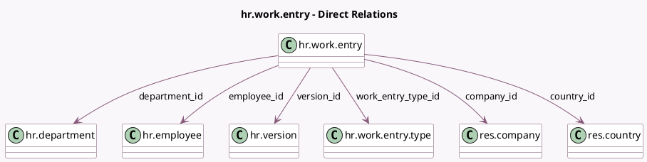

<!-- GENERATED:MODEL -->
---
tags: [odoo, community, generated, model]
---

# hr.work.entry

- Module: [[docs/Community Addons/hr_work_entry/hr_work_entry|hr_work_entry]]
- Scope: Community Addons
- Defined in module: yes
- Source files: `models/hr_work_entry.py`
- Python classes: `HrWorkEntry`
- Description: HR Work Entry

## Field footprint

- Detected fields: 18
- Field types: `Boolean` x 2, `Char` x 4, `Date` x 1, `Float` x 2, `Integer` x 1, `Many2one` x 6, `Selection` x 2
- Relation fields: 6

## Sample fields

- `active`: `Boolean`
- `amount_rate`: `Float` (comodel `Pay rate`)
- `code`: `Char` (related `work_entry_type_id.code`)
- `color`: `Integer` (related `work_entry_type_id.color`)
- `company_id`: `Many2one` (comodel `res.company`)
- `conflict`: `Boolean` (comodel `Conflicts`, compute `_compute_conflict`, store `True`)
- `country_id`: `Many2one` (comodel `res.country`, related `employee_id.company_id.country_id`)
- `date`: `Date`
- `department_id`: `Many2one` (comodel `hr.department`, related `employee_id.department_id`, store `True`)
- `display_code`: `Char` (related `work_entry_type_id.display_code`)
- `duration`: `Float`
- `employee_id`: `Many2one` (comodel `hr.employee`)
- `external_code`: `Char` (related `work_entry_type_id.external_code`)
- `name`: `Char`
- `state`: `Selection`
- `version_id`: `Many2one` (comodel `hr.version`)
- `work_entry_source`: `Selection` (related `version_id.work_entry_source`)
- `work_entry_type_id`: `Many2one` (comodel `hr.work.entry.type`)

## Method hints

- Detected methods: 20
- Action methods: `action_split`, `action_validate`
- Compute methods: `_compute_conflict`, `_compute_display_name`, `_compute_name`
- Onchange methods: `_onchange_version_id`

## Direct relation diagram

## Navigation

- **Parent:** [[docs/Community Addons/hr_work_entry/Models]]

<!-- GENERATED:MODEL -->
