<!-- GENERATED:MODEL -->
---
tags: [odoo, community, generated, model]
---

# hr.work.entry.regeneration.wizard

- Module: [[docs/Community Addons/hr_work_entry/hr_work_entry|hr_work_entry]]
- Scope: Community Addons
- Defined in module: yes
- Source files: `wizard/hr_work_entry_regeneration_wizard.py`
- Python classes: `HrWorkEntryRegenerationWizard`
- Description: Regenerate Employee Work Entries

## Field footprint

- Detected fields: 10
- Field types: `Boolean` x 2, `Char` x 2, `Date` x 4, `Many2many` x 2
- Relation fields: 2

## Sample fields

- `date_from`: `Date` (comodel `From`)
- `date_to`: `Date` (comodel `To`, compute `_compute_date_to`, store `True`)
- `earliest_available_date`: `Date` (comodel `Earliest date`, compute `_compute_earliest_available_date`)
- `earliest_available_date_message`: `Char` (store `False`)
- `employee_ids`: `Many2many` (comodel `hr.employee`)
- `latest_available_date`: `Date` (comodel `Latest date`, compute `_compute_latest_available_date`)
- `latest_available_date_message`: `Char` (store `False`)
- `search_criteria_completed`: `Boolean` (compute `_compute_search_criteria_completed`)
- `valid`: `Boolean` (compute `_compute_valid`)
- `validated_work_entry_employee_ids`: `Many2many` (comodel `hr.employee`, compute `_compute_validated_work_entry_employee_ids`)

## Method hints

- Detected methods: 10
- Action methods: none
- Compute methods: `_compute_date_to`, `_compute_earliest_available_date`, `_compute_latest_available_date`, `_compute_search_criteria_completed`, `_compute_valid`, `_compute_validated_work_entry_employee_ids`
- Onchange methods: `_check_dates`

## Direct relation diagram

```plantuml
@startuml
!define ODOO_COLOR_PRIMARY #714B67
!define ODOO_COLOR_ACCENT #875A7B
!define ODOO_COLOR_BG #FAF7FA

skinparam backgroundColor ODOO_COLOR_BG
skinparam defaultTextAlignment left
skinparam ArrowColor ODOO_COLOR_ACCENT
skinparam ClassBackgroundColor white
skinparam ClassBorderColor ODOO_COLOR_PRIMARY
skinparam ComponentBackgroundColor white
skinparam ComponentBorderColor ODOO_COLOR_PRIMARY
skinparam NoteBackgroundColor #FFF8FF
skinparam NoteBorderColor ODOO_COLOR_ACCENT
skinparam SequenceLifeLineBorderColor ODOO_COLOR_ACCENT
skinparam SequenceLifeLineBackgroundColor #FFFFFF
skinparam SequenceParticipantBorderColor ODOO_COLOR_PRIMARY
skinparam SequenceParticipantBackgroundColor #FFFFFF
skinparam sequence {
  ArrowColor ODOO_COLOR_ACCENT
  ActorBorderColor ODOO_COLOR_PRIMARY
}
title hr.work.entry.regeneration.wizard - Direct Relations
class "hr.work.entry.regeneration.wizard" as hr_work_entry_regeneration_wizard
class "hr.employee" as hr_employee
hr_work_entry_regeneration_wizard .. hr_employee : employee_ids
hr_work_entry_regeneration_wizard .. hr_employee : validated_work_entry_employee_ids
@enduml
```

## Navigation

- **Parent:** [[docs/Community Addons/hr_work_entry/Models]]

<!-- GENERATED:MODEL -->
