<!-- GENERATED:MODEL -->
---
tags: [odoo, community, generated, model]
---

# resource.calendar.attendance

- Module: [[docs/Community Addons/hr_work_entry/hr_work_entry|hr_work_entry]]
- Scope: Community Addons
- Defined in module: extension only
- Source files: `models/resource_calendar_attendance.py`
- Python classes: `ResourceCalendarAttendance`

## Field footprint

- Detected fields: 1
- Field types: `Many2one` x 1
- Relation fields: 1

## Sample fields

- `work_entry_type_id`: `Many2one` (comodel `hr.work.entry.type`)

## Method hints

- Detected methods: 3
- Action methods: none
- Compute methods: none
- Onchange methods: none

## Direct relation diagram

```plantuml
@startuml
!define ODOO_COLOR_PRIMARY #714B67
!define ODOO_COLOR_ACCENT #875A7B
!define ODOO_COLOR_BG #FAF7FA

skinparam backgroundColor ODOO_COLOR_BG
skinparam defaultTextAlignment left
skinparam ArrowColor ODOO_COLOR_ACCENT
skinparam ClassBackgroundColor white
skinparam ClassBorderColor ODOO_COLOR_PRIMARY
skinparam ComponentBackgroundColor white
skinparam ComponentBorderColor ODOO_COLOR_PRIMARY
skinparam NoteBackgroundColor #FFF8FF
skinparam NoteBorderColor ODOO_COLOR_ACCENT
skinparam SequenceLifeLineBorderColor ODOO_COLOR_ACCENT
skinparam SequenceLifeLineBackgroundColor #FFFFFF
skinparam SequenceParticipantBorderColor ODOO_COLOR_PRIMARY
skinparam SequenceParticipantBackgroundColor #FFFFFF
skinparam sequence {
  ArrowColor ODOO_COLOR_ACCENT
  ActorBorderColor ODOO_COLOR_PRIMARY
}
title resource.calendar.attendance - Direct Relations
class "resource.calendar.attendance" as resource_calendar_attendance
class "hr.work.entry.type" as hr_work_entry_type
resource_calendar_attendance --> hr_work_entry_type : work_entry_type_id
@enduml
```

## Navigation

- **Parent:** [[docs/Community Addons/hr_work_entry/Models]]

<!-- GENERATED:MODEL -->
