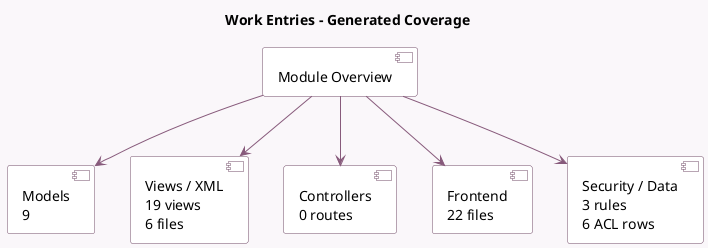

<!-- GENERATED:MODULE -->
---
tags: [odoo, community, module]
---

# Work Entries

- Scope: Community Addons
- Source: odoo/addons/hr_work_entry
- Dependencies: [[docs/Community Addons/hr/hr|hr]]

## Summary

Manage work entries

## Generated coverage

- Models: 9
- XML files with UI/data artifacts: 6
- Views: 19
- Actions: 4
- Menus: 0
- Rules (ir.rule): 3
- Access CSV entries: 6
- Controller units: 0
- Frontend asset files: 22

## Module map

## Detail notes

- Models: [[docs/Community Addons/hr_work_entry/Models|Models]] (9)
- Views and XML: [[docs/Community Addons/hr_work_entry/Views|Views]] (6 files)
- Frontend: [[docs/Community Addons/hr_work_entry/Frontend|Frontend]] (22 files)

## Key models

- `hr.employee`
- `hr.user.work.entry.employee`
- `hr.version`
- `hr.work.entry`
- `hr.work.entry.regeneration.wizard`
- `hr.work.entry.type`
- `resource.calendar`
- `resource.calendar.attendance`
- `resource.calendar.leaves`

## Navigation

- [[../Community Addons/Community Addons|Back to scope]]
- [[../../docs/docs|Back to docs]]

<!-- GENERATED:MODULE -->

