<!-- GENERATED:MODEL -->
---
tags: [odoo, community, generated, model]
---

# hr.work.entry

- Module: [[docs/Community Addons/hr_work_entry_holidays/hr_work_entry_holidays|hr_work_entry_holidays]]
- Scope: Community Addons
- Defined in module: extension only
- Source files: `models/hr_work_entry.py`
- Python classes: `HrWorkEntry`

## Field footprint

- Detected fields: 2
- Field types: `Many2one` x 1, `Selection` x 1
- Relation fields: 1

## Sample fields

- `leave_id`: `Many2one` (comodel `hr.leave`)
- `leave_state`: `Selection` (related `leave_id.state`)

## Method hints

- Detected methods: 5
- Action methods: `action_approve_leave`, `action_refuse_leave`
- Compute methods: none
- Onchange methods: none

## Direct relation diagram

```plantuml
@startuml
!define ODOO_COLOR_PRIMARY #714B67
!define ODOO_COLOR_ACCENT #875A7B
!define ODOO_COLOR_BG #FAF7FA

skinparam backgroundColor ODOO_COLOR_BG
skinparam defaultTextAlignment left
skinparam ArrowColor ODOO_COLOR_ACCENT
skinparam ClassBackgroundColor white
skinparam ClassBorderColor ODOO_COLOR_PRIMARY
skinparam ComponentBackgroundColor white
skinparam ComponentBorderColor ODOO_COLOR_PRIMARY
skinparam NoteBackgroundColor #FFF8FF
skinparam NoteBorderColor ODOO_COLOR_ACCENT
skinparam SequenceLifeLineBorderColor ODOO_COLOR_ACCENT
skinparam SequenceLifeLineBackgroundColor #FFFFFF
skinparam SequenceParticipantBorderColor ODOO_COLOR_PRIMARY
skinparam SequenceParticipantBackgroundColor #FFFFFF
skinparam sequence {
  ArrowColor ODOO_COLOR_ACCENT
  ActorBorderColor ODOO_COLOR_PRIMARY
}
title hr.work.entry - Direct Relations
class "hr.work.entry" as hr_work_entry
class "hr.leave" as hr_leave
hr_work_entry --> hr_leave : leave_id
@enduml
```

## Navigation

- **Parent:** [[docs/Community Addons/hr_work_entry_holidays/Models]]

<!-- GENERATED:MODEL -->
