<!-- GENERATED:MODEL -->
---
tags: [odoo, community, generated, model]
---

# html_editor.converter.test

- Module: [[docs/Community Addons/html_editor/html_editor|html_editor]]
- Scope: Community Addons
- Defined in module: yes
- Source files: `models/test_models.py`
- Python classes: `Html_EditorConverterTest`
- Description: Html Editor Converter Test

## Field footprint

- Detected fields: 11
- Field types: `Binary` x 1, `Char` x 1, `Date` x 1, `Datetime` x 1, `Float` x 2, `Html` x 1, `Integer` x 1, `Many2one` x 1, `Selection` x 1, `Text` x 1
- Relation fields: 1

## Sample fields

- `binary`: `Binary`
- `char`: `Char`
- `date`: `Date`
- `datetime`: `Datetime`
- `float`: `Float`
- `html`: `Html`
- `integer`: `Integer`
- `many2one`: `Many2one` (comodel `html_editor.converter.test.sub`)
- `numeric`: `Float`
- `selection_str`: `Selection`
- `text`: `Text`

## Method hints

- Detected methods: 0
- Action methods: none
- Compute methods: none
- Onchange methods: none

## Direct relation diagram

```plantuml
@startuml
!define ODOO_COLOR_PRIMARY #714B67
!define ODOO_COLOR_ACCENT #875A7B
!define ODOO_COLOR_BG #FAF7FA

skinparam backgroundColor ODOO_COLOR_BG
skinparam defaultTextAlignment left
skinparam ArrowColor ODOO_COLOR_ACCENT
skinparam ClassBackgroundColor white
skinparam ClassBorderColor ODOO_COLOR_PRIMARY
skinparam ComponentBackgroundColor white
skinparam ComponentBorderColor ODOO_COLOR_PRIMARY
skinparam NoteBackgroundColor #FFF8FF
skinparam NoteBorderColor ODOO_COLOR_ACCENT
skinparam SequenceLifeLineBorderColor ODOO_COLOR_ACCENT
skinparam SequenceLifeLineBackgroundColor #FFFFFF
skinparam SequenceParticipantBorderColor ODOO_COLOR_PRIMARY
skinparam SequenceParticipantBackgroundColor #FFFFFF
skinparam sequence {
  ArrowColor ODOO_COLOR_ACCENT
  ActorBorderColor ODOO_COLOR_PRIMARY
}
title html_editor.converter.test - Direct Relations
class "html_editor.converter.test" as html_editor_converter_test
class "html_editor.converter.test.sub" as html_editor_converter_test_sub
html_editor_converter_test --> html_editor_converter_test_sub : many2one
@enduml
```

## Navigation

- **Parent:** [[docs/Community Addons/html_editor/Models]]

<!-- GENERATED:MODEL -->
