<!-- GENERATED:MODEL -->
---
tags: [odoo, community, generated, model]
---

# ir.attachment

- Module: [[docs/Community Addons/html_editor/html_editor|html_editor]]
- Scope: Community Addons
- Defined in module: extension only
- Source files: `models/ir_attachment.py`
- Python classes: `IrAttachment`

## Field footprint

- Detected fields: 5
- Field types: `Char` x 2, `Integer` x 2, `Many2one` x 1
- Relation fields: 1

## Sample fields

- `image_height`: `Integer` (compute `_compute_image_size`)
- `image_src`: `Char` (compute `_compute_image_src`)
- `image_width`: `Integer` (compute `_compute_image_size`)
- `local_url`: `Char` (comodel `Attachment URL`, compute `_compute_local_url`)
- `original_id`: `Many2one` (comodel `ir.attachment`)

## Method hints

- Detected methods: 5
- Action methods: none
- Compute methods: `_compute_image_size`, `_compute_image_src`, `_compute_local_url`
- Onchange methods: none

## Direct relation diagram

```plantuml
@startuml
!define ODOO_COLOR_PRIMARY #714B67
!define ODOO_COLOR_ACCENT #875A7B
!define ODOO_COLOR_BG #FAF7FA

skinparam backgroundColor ODOO_COLOR_BG
skinparam defaultTextAlignment left
skinparam ArrowColor ODOO_COLOR_ACCENT
skinparam ClassBackgroundColor white
skinparam ClassBorderColor ODOO_COLOR_PRIMARY
skinparam ComponentBackgroundColor white
skinparam ComponentBorderColor ODOO_COLOR_PRIMARY
skinparam NoteBackgroundColor #FFF8FF
skinparam NoteBorderColor ODOO_COLOR_ACCENT
skinparam SequenceLifeLineBorderColor ODOO_COLOR_ACCENT
skinparam SequenceLifeLineBackgroundColor #FFFFFF
skinparam SequenceParticipantBorderColor ODOO_COLOR_PRIMARY
skinparam SequenceParticipantBackgroundColor #FFFFFF
skinparam sequence {
  ArrowColor ODOO_COLOR_ACCENT
  ActorBorderColor ODOO_COLOR_PRIMARY
}
title ir.attachment - Direct Relations
class "ir.attachment" as ir_attachment
class "ir.attachment" as ir_attachment
ir_attachment --> ir_attachment : original_id
@enduml
```

## Navigation

- **Parent:** [[docs/Community Addons/html_editor/Models]]

<!-- GENERATED:MODEL -->
