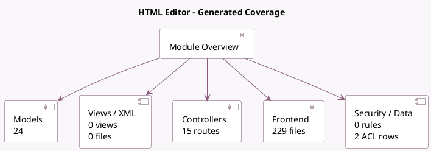

<!-- GENERATED:MODULE -->
---
tags: [odoo, community, module]
---

# HTML Editor

- Scope: Community Addons
- Source: odoo/addons/html_editor
- Dependencies: base (not documented), [[docs/Community Addons/bus/bus|bus]], [[docs/Community Addons/web/web|web]]

## Summary

        A Html Editor component and plugin system
    

## Generated coverage

- Models: 24
- XML files with UI/data artifacts: 0
- Views: 0
- Actions: 0
- Menus: 0
- Rules (ir.rule): 0
- Access CSV entries: 2
- Controller units: 1
- Frontend asset files: 229

## Module map

## Detail notes

- Models: [[docs/Community Addons/html_editor/Models|Models]] (24)
- Controllers: [[docs/Community Addons/html_editor/Controllers|Controllers]] (1)
- Frontend: [[docs/Community Addons/html_editor/Frontend|Frontend]] (229 files)

## Key models

- `base`
- `html.field.history.mixin`
- `html_editor.converter.test`
- `html_editor.converter.test.sub`
- `ir.attachment`
- `ir.http`
- `ir.qweb`
- `ir.qweb.field`
- `ir.qweb.field.contact`
- `ir.qweb.field.date`
- `ir.qweb.field.datetime`
- `ir.qweb.field.duration`

## Navigation

- [[../Community Addons/Community Addons|Back to scope]]
- [[../../docs/docs|Back to docs]]

<!-- GENERATED:MODULE -->

