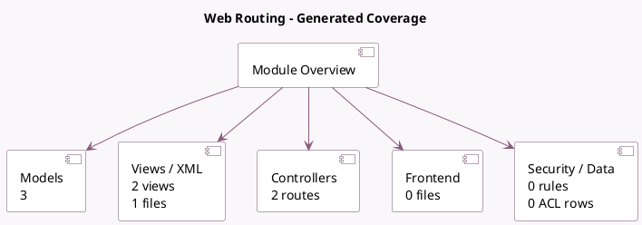

<!-- GENERATED:MODULE -->
---
tags: [odoo, community, module]
---

# Web Routing

- Scope: Community Addons
- Source: odoo/addons/http_routing
- Dependencies: [[docs/Community Addons/web/web|web]]

## Summary

Web Routing

## Generated coverage

- Models: 3
- XML files with UI/data artifacts: 1
- Views: 2
- Actions: 0
- Menus: 0
- Rules (ir.rule): 0
- Access CSV entries: 0
- Controller units: 2
- Frontend asset files: 0

## Module map

## Detail notes

- Models: [[docs/Community Addons/http_routing/Models|Models]] (3)
- Views and XML: [[docs/Community Addons/http_routing/Views|Views]] (1 files)
- Controllers: [[docs/Community Addons/http_routing/Controllers|Controllers]] (2)

## Key models

- `ir.http`
- `ir.qweb`
- `res.lang`

## Navigation

- [[../Community Addons/Community Addons|Back to scope]]
- [[../../docs/docs|Back to docs]]

<!-- GENERATED:MODULE -->

## Curated analysis

### Functional role
- `http_routing` is the frontend-aware routing layer used by website-facing flows.
- It extends base HTTP dispatch with multilingual URL rewriting, slug-aware model converters, frontend QWeb helpers, and website error handling.

### What it changes in practice
- `ir.http` is extended to redirect or rewrite language-prefixed URLs, keep `request.lang` in sync, and canonicalize frontend record URLs through slugs.
- `ir.qweb` receives frontend helpers such as `slug`, `unslug_url`, `url_for`, and `url_localized`.
- The module also serves website translation payloads and plugs in frontend-specific 403/404/500 rendering.

### Operational boundaries
- Frontend multilang behavior is tied to route metadata like `website=True`, `multilang`, and the route `type`.
- The module assumes normal request dispatch has set `request.is_frontend` before frontend QWeb rendering. Ad hoc template rendering from atypical controller flows is a common source of edge cases.
- Slug generation is not just cosmetic; `http_routing` uses redirects to push browsers toward canonical SEO-friendly URLs.

### Evidence
- Routing and language handling: `odoo19/addons/http_routing/models/ir_http.py`
- Frontend QWeb environment: `odoo19/addons/http_routing/models/ir_qweb.py`
- Translation endpoint and website session overrides: `odoo19/addons/http_routing/controllers/main.py`

### Related notes
- `[[docs/Core/Framework/http]]`
- `[[docs/Core/Framework/web]]`
