<!-- GENERATED:MODEL -->
---
tags: [odoo, community, generated, model]
---

# iap.account

- Module: [[docs/Community Addons/iap/iap|iap]]
- Scope: Community Addons
- Defined in module: yes
- Source files: `models/iap_account.py`
- Python classes: `IapAccount`
- Description: IAP Account

## Field footprint

- Detected fields: 11
- Field types: `Boolean` x 1, `Char` x 5, `Float` x 1, `Many2many` x 2, `Many2one` x 1, `Selection` x 1
- Relation fields: 3

## Sample fields

- `account_token`: `Char`
- `balance`: `Char`
- `company_ids`: `Many2many` (comodel `res.company`)
- `description`: `Char` (related `service_id.description`)
- `name`: `Char`
- `service_id`: `Many2one` (comodel `iap.service`)
- `service_locked`: `Boolean`
- `service_name`: `Char` (related `service_id.technical_name`)
- `state`: `Selection`
- `warning_threshold`: `Float` (comodel `Email Alert Threshold`)
- `warning_user_ids`: `Many2many` (comodel `res.users`)

## Method hints

- Detected methods: 14
- Action methods: `action_buy_credits`
- Compute methods: none
- Onchange methods: none

## Direct relation diagram

```plantuml
@startuml
!define ODOO_COLOR_PRIMARY #714B67
!define ODOO_COLOR_ACCENT #875A7B
!define ODOO_COLOR_BG #FAF7FA

skinparam backgroundColor ODOO_COLOR_BG
skinparam defaultTextAlignment left
skinparam ArrowColor ODOO_COLOR_ACCENT
skinparam ClassBackgroundColor white
skinparam ClassBorderColor ODOO_COLOR_PRIMARY
skinparam ComponentBackgroundColor white
skinparam ComponentBorderColor ODOO_COLOR_PRIMARY
skinparam NoteBackgroundColor #FFF8FF
skinparam NoteBorderColor ODOO_COLOR_ACCENT
skinparam SequenceLifeLineBorderColor ODOO_COLOR_ACCENT
skinparam SequenceLifeLineBackgroundColor #FFFFFF
skinparam SequenceParticipantBorderColor ODOO_COLOR_PRIMARY
skinparam SequenceParticipantBackgroundColor #FFFFFF
skinparam sequence {
  ArrowColor ODOO_COLOR_ACCENT
  ActorBorderColor ODOO_COLOR_PRIMARY
}
title iap.account - Direct Relations
class "iap.account" as iap_account
class "iap.service" as iap_service
class "res.company" as res_company
class "res.users" as res_users
iap_account --> iap_service : service_id
iap_account .. res_company : company_ids
iap_account .. res_users : warning_user_ids
@enduml
```

## Navigation

- **Parent:** [[docs/Community Addons/iap/Models]]

<!-- GENERATED:MODEL -->
