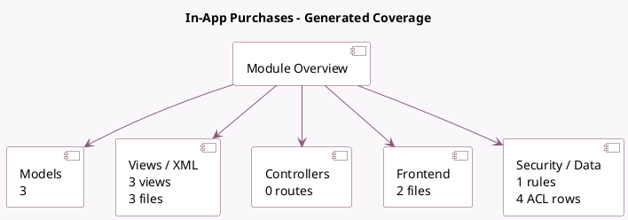

<!-- GENERATED:MODULE -->
---
tags: [odoo, community, module]
---

# In-App Purchases

- Scope: Community Addons
- Source: odoo/addons/iap
- Dependencies: [[docs/Community Addons/web/web|web]], [[docs/Community Addons/base_setup/base_setup|base_setup]]

## Summary

Basic models and helpers to support In-App purchases.

## Generated coverage

- Models: 3
- XML files with UI/data artifacts: 3
- Views: 3
- Actions: 1
- Menus: 2
- Rules (ir.rule): 1
- Access CSV entries: 4
- Controller units: 0
- Frontend asset files: 2

## Module map

## Detail notes

- Models: [[docs/Community Addons/iap/Models|Models]] (3)
- Views and XML: [[docs/Community Addons/iap/Views|Views]] (3 files)
- Frontend: [[docs/Community Addons/iap/Frontend|Frontend]] (2 files)

## Key models

- `iap.account`
- `iap.enrich.api`
- `iap.service`

## Navigation

- [[../Community Addons/Community Addons|Back to scope]]
- [[../../docs/docs|Back to docs]]

<!-- GENERATED:MODULE -->

