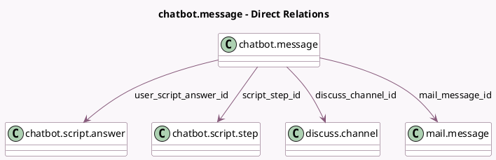

<!-- GENERATED:MODEL -->
---
tags: [odoo, community, generated, model]
---

# chatbot.message

- Module: [[docs/Community Addons/im_livechat/im_livechat|im_livechat]]
- Scope: Community Addons
- Defined in module: yes
- Source files: `models/chatbot_message.py`
- Python classes: `ChatbotMessage`
- Description: Chatbot Message

## Field footprint

- Detected fields: 6
- Field types: `Html` x 1, `Integer` x 1, `Many2one` x 4
- Relation fields: 4

## Sample fields

- `discuss_channel_id`: `Many2one` (comodel `discuss.channel`)
- `mail_message_id`: `Many2one` (comodel `mail.message`)
- `script_step_id`: `Many2one` (comodel `chatbot.script.step`)
- `user_raw_answer`: `Html`
- `user_raw_script_answer_id`: `Integer`
- `user_script_answer_id`: `Many2one` (comodel `chatbot.script.answer`)

## Method hints

- Detected methods: 0
- Action methods: none
- Compute methods: none
- Onchange methods: none

## Direct relation diagram

## Navigation

- **Parent:** [[docs/Community Addons/im_livechat/Models]]

<!-- GENERATED:MODEL -->
