<!-- GENERATED:MODEL -->
---
tags: [odoo, community, generated, model]
---

# chatbot.script.answer

- Module: [[docs/Community Addons/im_livechat/im_livechat|im_livechat]]
- Scope: Community Addons
- Defined in module: yes
- Source files: `models/chatbot_script_answer.py`
- Python classes: `ChatbotScriptAnswer`
- Description: Chatbot Script Answer

## Field footprint

- Detected fields: 5
- Field types: `Char` x 2, `Integer` x 1, `Many2one` x 2
- Relation fields: 2

## Sample fields

- `chatbot_script_id`: `Many2one` (related `script_step_id.chatbot_script_id`)
- `name`: `Char`
- `redirect_link`: `Char` (comodel `Redirect Link`)
- `script_step_id`: `Many2one` (comodel `chatbot.script.step`)
- `sequence`: `Integer`

## Method hints

- Detected methods: 3
- Action methods: none
- Compute methods: `_compute_display_name`
- Onchange methods: none

## Direct relation diagram

```plantuml
@startuml
!define ODOO_COLOR_PRIMARY #714B67
!define ODOO_COLOR_ACCENT #875A7B
!define ODOO_COLOR_BG #FAF7FA

skinparam backgroundColor ODOO_COLOR_BG
skinparam defaultTextAlignment left
skinparam ArrowColor ODOO_COLOR_ACCENT
skinparam ClassBackgroundColor white
skinparam ClassBorderColor ODOO_COLOR_PRIMARY
skinparam ComponentBackgroundColor white
skinparam ComponentBorderColor ODOO_COLOR_PRIMARY
skinparam NoteBackgroundColor #FFF8FF
skinparam NoteBorderColor ODOO_COLOR_ACCENT
skinparam SequenceLifeLineBorderColor ODOO_COLOR_ACCENT
skinparam SequenceLifeLineBackgroundColor #FFFFFF
skinparam SequenceParticipantBorderColor ODOO_COLOR_PRIMARY
skinparam SequenceParticipantBackgroundColor #FFFFFF
skinparam sequence {
  ArrowColor ODOO_COLOR_ACCENT
  ActorBorderColor ODOO_COLOR_PRIMARY
}
title chatbot.script.answer - Direct Relations
class "chatbot.script.answer" as chatbot_script_answer
class "chatbot.script.step" as chatbot_script_step
chatbot_script_answer --> chatbot_script_step : script_step_id
@enduml
```

## Navigation

- **Parent:** [[docs/Community Addons/im_livechat/Models]]

<!-- GENERATED:MODEL -->
