<!-- GENERATED:MODEL -->
---
tags: [odoo, community, generated, model]
---

# chatbot.script

- Module: [[docs/Community Addons/im_livechat/im_livechat|im_livechat]]
- Scope: Community Addons
- Defined in module: yes
- Source files: `models/chatbot_script.py`
- Python classes: `ChatbotScript`
- Description: Chatbot Script
- Inherits: `image.mixin`, `utm.source.mixin`

## Field footprint

- Detected fields: 7
- Field types: `Boolean` x 1, `Char` x 1, `Image` x 1, `Integer` x 1, `Many2one` x 1, `One2many` x 1, `Selection` x 1
- Relation fields: 2

## Sample fields

- `active`: `Boolean`
- `first_step_warning`: `Selection` (compute `_compute_first_step_warning`)
- `image_1920`: `Image` (related `operator_partner_id.image_1920`)
- `livechat_channel_count`: `Integer` (compute `_compute_livechat_channel_count`)
- `operator_partner_id`: `Many2one` (comodel `res.partner`)
- `script_step_ids`: `One2many` (comodel `chatbot.script.step`)
- `title`: `Char` (comodel `Title`)

## Method hints

- Detected methods: 14
- Action methods: `action_view_livechat_channels`
- Compute methods: `_compute_first_step_warning`, `_compute_livechat_channel_count`
- Onchange methods: `_onchange_script_step_ids`

## Direct relation diagram

```plantuml
@startuml
!define ODOO_COLOR_PRIMARY #714B67
!define ODOO_COLOR_ACCENT #875A7B
!define ODOO_COLOR_BG #FAF7FA

skinparam backgroundColor ODOO_COLOR_BG
skinparam defaultTextAlignment left
skinparam ArrowColor ODOO_COLOR_ACCENT
skinparam ClassBackgroundColor white
skinparam ClassBorderColor ODOO_COLOR_PRIMARY
skinparam ComponentBackgroundColor white
skinparam ComponentBorderColor ODOO_COLOR_PRIMARY
skinparam NoteBackgroundColor #FFF8FF
skinparam NoteBorderColor ODOO_COLOR_ACCENT
skinparam SequenceLifeLineBorderColor ODOO_COLOR_ACCENT
skinparam SequenceLifeLineBackgroundColor #FFFFFF
skinparam SequenceParticipantBorderColor ODOO_COLOR_PRIMARY
skinparam SequenceParticipantBackgroundColor #FFFFFF
skinparam sequence {
  ArrowColor ODOO_COLOR_ACCENT
  ActorBorderColor ODOO_COLOR_PRIMARY
}
title chatbot.script - Direct Relations
class "chatbot.script" as chatbot_script
class "chatbot.script.step" as chatbot_script_step
class "res.partner" as res_partner
chatbot_script --|> chatbot_script_step : script_step_ids
chatbot_script --> res_partner : operator_partner_id
@enduml
```

## Navigation

- **Parent:** [[docs/Community Addons/im_livechat/Models]]

<!-- GENERATED:MODEL -->
