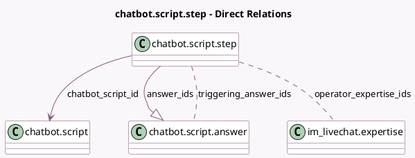

<!-- GENERATED:MODEL -->
---
tags: [odoo, community, generated, model]
---

# chatbot.script.step

- Module: [[docs/Community Addons/im_livechat/im_livechat|im_livechat]]
- Scope: Community Addons
- Defined in module: yes
- Source files: `models/chatbot_script_step.py`
- Python classes: `ChatbotScriptStep`
- Description: Chatbot Script Step

## Field footprint

- Detected fields: 10
- Field types: `Boolean` x 2, `Char` x 1, `Html` x 1, `Integer` x 1, `Many2many` x 2, `Many2one` x 1, `One2many` x 1, `Selection` x 1
- Relation fields: 4

## Sample fields

- `answer_ids`: `One2many` (comodel `chatbot.script.answer`)
- `chatbot_script_id`: `Many2one` (comodel `chatbot.script`)
- `is_forward_operator`: `Boolean` (compute `_compute_is_forward_operator`)
- `is_forward_operator_child`: `Boolean` (compute `_compute_is_forward_operator_child`)
- `message`: `Html`
- `name`: `Char` (compute `_compute_name`)
- `operator_expertise_ids`: `Many2many` (comodel `im_livechat.expertise`)
- `sequence`: `Integer`
- `step_type`: `Selection`
- `triggering_answer_ids`: `Many2many` (comodel `chatbot.script.answer`, compute `_compute_triggering_answer_ids`, store `True`)

## Method hints

- Detected methods: 13
- Action methods: none
- Compute methods: `_compute_is_forward_operator`, `_compute_is_forward_operator_child`, `_compute_name`, `_compute_triggering_answer_ids`
- Onchange methods: none

## Direct relation diagram

## Navigation

- **Parent:** [[docs/Community Addons/im_livechat/Models]]

<!-- GENERATED:MODEL -->
