<!-- GENERATED:MODEL -->
---
tags: [odoo, community, generated, model]
---

# discuss.channel

- Module: [[docs/Community Addons/im_livechat/im_livechat|im_livechat]]
- Scope: Community Addons
- Defined in module: yes
- Source files: `models/discuss_channel.py`
- Python classes: `DiscussChannel`
- Inherits: `rating.mixin`

## Field footprint

- Detected fields: 31
- Field types: `Boolean` x 3, `Datetime` x 1, `Float` x 2, `Html` x 1, `Many2many` x 6, `Many2one` x 7, `One2many` x 5, `Selection` x 6
- Relation fields: 18

## Sample fields

- `channel_type`: `Selection`
- `chatbot_current_step_id`: `Many2one` (comodel `chatbot.script.step`)
- `chatbot_message_ids`: `One2many` (comodel `chatbot.message`)
- `country_id`: `Many2one` (comodel `res.country`)
- `duration`: `Float` (comodel `Duration`, compute `_compute_duration`)
- `livechat_agent_history_ids`: `One2many` (comodel `im_livechat.channel.member.history`, compute `_compute_livechat_agent_history_ids`)
- `livechat_agent_partner_ids`: `Many2many` (comodel `res.partner`, compute `_compute_livechat_agent_partner_ids`, store `True`)
- `livechat_agent_providing_help_history`: `Many2one` (comodel `im_livechat.channel.member.history`, compute `_compute_livechat_agent_providing_help_history`, store `True`)
- `livechat_agent_requesting_help_history`: `Many2one` (comodel `im_livechat.channel.member.history`, compute `_compute_livechat_agent_requesting_help_history`, store `True`)
- `livechat_bot_history_ids`: `One2many` (comodel `im_livechat.channel.member.history`, compute `_compute_livechat_bot_history_ids`)
- `livechat_bot_partner_ids`: `Many2many` (comodel `res.partner`, compute `_compute_livechat_bot_partner_ids`, store `True`)
- `livechat_channel_id`: `Many2one` (comodel `im_livechat.channel`)
- `livechat_channel_member_history_ids`: `One2many` (comodel `im_livechat.channel.member.history`)
- `livechat_conversation_tag_ids`: `Many2many` (comodel `im_livechat.conversation.tag`)
- `livechat_customer_guest_ids`: `Many2many` (comodel `mail.guest`, compute `_compute_livechat_customer_guest_ids`)
- `livechat_customer_history_ids`: `One2many` (comodel `im_livechat.channel.member.history`, compute `_compute_livechat_customer_history_ids`)
- `livechat_customer_partner_ids`: `Many2many` (comodel `res.partner`, compute `_compute_livechat_customer_partner_ids`, store `True`)
- `livechat_end_dt`: `Datetime` (comodel `Session end date`)
- `livechat_expertise_ids`: `Many2many` (comodel `im_livechat.expertise`, related `livechat_agent_history_ids.agent_expertise_ids`, store `True`)
- `livechat_failure`: `Selection`

## Method hints

- Detected methods: 53
- Action methods: none
- Compute methods: `_compute_duration`, `_compute_livechat_agent_history_ids`, `_compute_livechat_agent_partner_ids`, `_compute_livechat_agent_providing_help_history`, `_compute_livechat_agent_requesting_help_history`, `_compute_livechat_bot_history_ids`, `_compute_livechat_bot_partner_ids`, `_compute_livechat_customer_guest_ids`, and 9 more
- Onchange methods: none

## Direct relation diagram

```plantuml
@startuml
!define ODOO_COLOR_PRIMARY #714B67
!define ODOO_COLOR_ACCENT #875A7B
!define ODOO_COLOR_BG #FAF7FA

skinparam backgroundColor ODOO_COLOR_BG
skinparam defaultTextAlignment left
skinparam ArrowColor ODOO_COLOR_ACCENT
skinparam ClassBackgroundColor white
skinparam ClassBorderColor ODOO_COLOR_PRIMARY
skinparam ComponentBackgroundColor white
skinparam ComponentBorderColor ODOO_COLOR_PRIMARY
skinparam NoteBackgroundColor #FFF8FF
skinparam NoteBorderColor ODOO_COLOR_ACCENT
skinparam SequenceLifeLineBorderColor ODOO_COLOR_ACCENT
skinparam SequenceLifeLineBackgroundColor #FFFFFF
skinparam SequenceParticipantBorderColor ODOO_COLOR_PRIMARY
skinparam SequenceParticipantBackgroundColor #FFFFFF
skinparam sequence {
  ArrowColor ODOO_COLOR_ACCENT
  ActorBorderColor ODOO_COLOR_PRIMARY
}
title discuss.channel - Direct Relations
class "discuss.channel" as discuss_channel
class "chatbot.message" as chatbot_message
class "chatbot.script.step" as chatbot_script_step
class "im_livechat.channel" as im_livechat_channel
class "im_livechat.channel.member.history" as im_livechat_channel_member_history
class "im_livechat.conversation.tag" as im_livechat_conversation_tag
class "im_livechat.expertise" as im_livechat_expertise
class "mail.guest" as mail_guest
class "res.country" as res_country
class "res.lang" as res_lang
class "res.partner" as res_partner
discuss_channel --> res_lang : livechat_lang_id
discuss_channel --> im_livechat_channel : livechat_channel_id
discuss_channel --> res_partner : livechat_operator_id
discuss_channel --|> im_livechat_channel_member_history : livechat_channel_member_history_ids
discuss_channel .. im_livechat_expertise : livechat_expertise_ids
discuss_channel --|> im_livechat_channel_member_history : livechat_agent_history_ids
discuss_channel --|> im_livechat_channel_member_history : livechat_bot_history_ids
discuss_channel --|> im_livechat_channel_member_history : livechat_customer_history_ids
discuss_channel .. res_partner : livechat_agent_partner_ids
discuss_channel .. res_partner : livechat_bot_partner_ids
discuss_channel .. res_partner : livechat_customer_partner_ids
discuss_channel .. mail_guest : livechat_customer_guest_ids
discuss_channel --> im_livechat_channel_member_history : livechat_agent_requesting_help_history
discuss_channel --> im_livechat_channel_member_history : livechat_agent_providing_help_history
discuss_channel .. im_livechat_conversation_tag : livechat_conversation_tag_ids
discuss_channel --> chatbot_script_step : chatbot_current_step_id
discuss_channel --|> chatbot_message : chatbot_message_ids
discuss_channel --> res_country : country_id
@enduml
```

## Navigation

- **Parent:** [[docs/Community Addons/im_livechat/Models]]

<!-- GENERATED:MODEL -->
