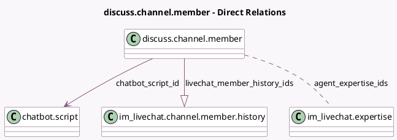

<!-- GENERATED:MODEL -->
---
tags: [odoo, community, generated, model]
---

# discuss.channel.member

- Module: [[docs/Community Addons/im_livechat/im_livechat|im_livechat]]
- Scope: Community Addons
- Defined in module: extension only
- Source files: `models/discuss_channel_member.py`
- Python classes: `DiscussChannelMember`

## Field footprint

- Detected fields: 4
- Field types: `Many2many` x 1, `Many2one` x 1, `One2many` x 1, `Selection` x 1
- Relation fields: 3

## Sample fields

- `agent_expertise_ids`: `Many2many` (comodel `im_livechat.expertise`, compute `_compute_agent_expertise_ids`)
- `chatbot_script_id`: `Many2one` (comodel `chatbot.script`, compute `_compute_chatbot_script_id`)
- `livechat_member_history_ids`: `One2many` (comodel `im_livechat.channel.member.history`)
- `livechat_member_type`: `Selection` (compute `_compute_livechat_member_type`)

## Method hints

- Detected methods: 15
- Action methods: none
- Compute methods: `_compute_agent_expertise_ids`, `_compute_chatbot_script_id`, `_compute_livechat_member_type`
- Onchange methods: none

## Direct relation diagram

## Navigation

- **Parent:** [[docs/Community Addons/im_livechat/Models]]

<!-- GENERATED:MODEL -->
