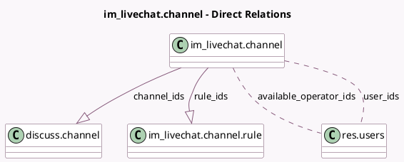

<!-- GENERATED:MODEL -->
---
tags: [odoo, community, generated, model]
---

# im_livechat.channel

- Module: [[docs/Community Addons/im_livechat/im_livechat|im_livechat]]
- Scope: Community Addons
- Defined in module: yes
- Source files: `models/im_livechat_channel.py`
- Python classes: `Im_LivechatChannel`
- Description: Livechat Channel
- Inherits: `rating.parent.mixin`

## Field footprint

- Detected fields: 22
- Field types: `Boolean` x 2, `Char` x 9, `Html` x 1, `Integer` x 5, `Many2many` x 2, `One2many` x 2, `Selection` x 1
- Relation fields: 4

## Sample fields

- `are_you_inside`: `Boolean` (compute `_are_you_inside`, store `False`)
- `available_operator_ids`: `Many2many` (comodel `res.users`, compute `_compute_available_operator_ids`)
- `block_assignment_during_call`: `Boolean` (comodel `No Chats During Call`)
- `button_background_color`: `Char`
- `button_text`: `Char` (comodel `Text of the Button`)
- `button_text_color`: `Char`
- `channel_ids`: `One2many` (comodel `discuss.channel`)
- `chatbot_script_count`: `Integer` (compute `_compute_chatbot_script_count`)
- `default_message`: `Char` (comodel `Welcome Message`)
- `header_background_color`: `Char`
- `max_sessions`: `Integer`
- `max_sessions_mode`: `Selection`
- `name`: `Char` (comodel `Channel Name`)
- `nbr_channel`: `Integer` (comodel `Number of conversation`, compute `_compute_nbr_channel`, store `False`)
- `ongoing_session_count`: `Integer` (comodel `Number of Ongoing Sessions`, compute `_compute_ongoing_sessions_count`)
- `remaining_session_capacity`: `Integer` (comodel `Remaining Session Capacity`, compute `_compute_remaining_session_capacity`)
- `review_link`: `Char` (comodel `Review Link`)
- `rule_ids`: `One2many` (comodel `im_livechat.channel.rule`)
- `script_external`: `Html` (comodel `Script (external)`, compute `_compute_script_external`, store `False`)
- `title_color`: `Char`

## Method hints

- Detected methods: 28
- Action methods: `action_join`, `action_quit`, `action_view_chatbot_scripts`, `action_view_rating`
- Compute methods: `_compute_available_operator_ids`, `_compute_chatbot_script_count`, `_compute_nbr_channel`, `_compute_ongoing_sessions_count`, `_compute_remaining_session_capacity`, `_compute_script_external`, `_compute_web_page_link`
- Onchange methods: none

## Direct relation diagram

## Navigation

- **Parent:** [[docs/Community Addons/im_livechat/Models]]

<!-- GENERATED:MODEL -->
