<!-- GENERATED:MODEL -->
---
tags: [odoo, community, generated, model]
---

# im_livechat.channel.member.history

- Module: [[docs/Community Addons/im_livechat/im_livechat|im_livechat]]
- Scope: Community Addons
- Defined in module: yes
- Source files: `models/im_livechat_channel_member_history.py`
- Python classes: `ImLivechatChannelMemberHistory`
- Description: Keep the channel member history

## Field footprint

- Detected fields: 26
- Field types: `Binary` x 1, `Float` x 8, `Integer` x 1, `Many2many` x 3, `Many2one` x 8, `Selection` x 5
- Relation fields: 11

## Sample fields

- `agent_expertise_ids`: `Many2many` (comodel `im_livechat.expertise`, compute `_compute_member_fields`, store `True`)
- `avatar_128`: `Binary` (compute `_compute_avatar_128`)
- `call_count`: `Float` (comodel `# of Sessions with Calls`, related `has_call`)
- `call_duration_hour`: `Float` (comodel `Call Duration`, compute `_compute_call_duration_hour`, store `True`)
- `call_history_ids`: `Many2many` (comodel `discuss.call.history`)
- `call_percentage`: `Float` (comodel `Session with Calls (%)`, related `has_call`)
- `channel_id`: `Many2one` (comodel `discuss.channel`, compute `_compute_member_fields`, store `True`)
- `chatbot_script_id`: `Many2one` (comodel `chatbot.script`, compute `_compute_member_fields`, store `True`)
- `conversation_tag_ids`: `Many2many` (comodel `im_livechat.conversation.tag`, related `channel_id.livechat_conversation_tag_ids`)
- `guest_id`: `Many2one` (comodel `mail.guest`, compute `_compute_member_fields`, store `True`)
- `has_call`: `Float` (compute `_compute_has_call`, store `True`)
- `help_status`: `Selection` (compute `_compute_help_status`, store `True`)
- `livechat_member_type`: `Selection` (compute `_compute_member_fields`, store `True`)
- `member_id`: `Many2one` (comodel `discuss.channel.member`)
- `message_count`: `Integer` (comodel `# of Messages per Session`)
- `partner_id`: `Many2one` (comodel `res.partner`, compute `_compute_member_fields`, store `True`)
- `rating`: `Float` (related `rating_id.rating`)
- `rating_id`: `Many2one` (comodel `rating.rating`, compute `_compute_rating_id`, store `True`)
- `rating_text`: `Selection` (related `rating_id.rating_text`)
- `response_time_hour`: `Float` (comodel `Response Time`)

## Method hints

- Detected methods: 10
- Action methods: `action_open_discuss_channel_view`
- Compute methods: `_compute_avatar_128`, `_compute_call_duration_hour`, `_compute_display_name`, `_compute_has_call`, `_compute_help_status`, `_compute_member_fields`, `_compute_rating_id`, `_compute_session_duration_hour`
- Onchange methods: none

## Direct relation diagram

```plantuml
@startuml
!define ODOO_COLOR_PRIMARY #714B67
!define ODOO_COLOR_ACCENT #875A7B
!define ODOO_COLOR_BG #FAF7FA

skinparam backgroundColor ODOO_COLOR_BG
skinparam defaultTextAlignment left
skinparam ArrowColor ODOO_COLOR_ACCENT
skinparam ClassBackgroundColor white
skinparam ClassBorderColor ODOO_COLOR_PRIMARY
skinparam ComponentBackgroundColor white
skinparam ComponentBorderColor ODOO_COLOR_PRIMARY
skinparam NoteBackgroundColor #FFF8FF
skinparam NoteBorderColor ODOO_COLOR_ACCENT
skinparam SequenceLifeLineBorderColor ODOO_COLOR_ACCENT
skinparam SequenceLifeLineBackgroundColor #FFFFFF
skinparam SequenceParticipantBorderColor ODOO_COLOR_PRIMARY
skinparam SequenceParticipantBackgroundColor #FFFFFF
skinparam sequence {
  ArrowColor ODOO_COLOR_ACCENT
  ActorBorderColor ODOO_COLOR_PRIMARY
}
title im_livechat.channel.member.history - Direct Relations
class "im_livechat.channel.member.history" as im_livechat_channel_member_history
class "chatbot.script" as chatbot_script
class "discuss.call.history" as discuss_call_history
class "discuss.channel" as discuss_channel
class "discuss.channel.member" as discuss_channel_member
class "im_livechat.channel" as im_livechat_channel
class "im_livechat.conversation.tag" as im_livechat_conversation_tag
class "im_livechat.expertise" as im_livechat_expertise
class "mail.guest" as mail_guest
class "rating.rating" as rating_rating
class "res.country" as res_country
class "res.partner" as res_partner
im_livechat_channel_member_history --> discuss_channel_member : member_id
im_livechat_channel_member_history --> discuss_channel : channel_id
im_livechat_channel_member_history --> mail_guest : guest_id
im_livechat_channel_member_history --> res_partner : partner_id
im_livechat_channel_member_history --> chatbot_script : chatbot_script_id
im_livechat_channel_member_history .. im_livechat_expertise : agent_expertise_ids
im_livechat_channel_member_history .. im_livechat_conversation_tag : conversation_tag_ids
im_livechat_channel_member_history --> res_country : session_country_id
im_livechat_channel_member_history --> im_livechat_channel : session_livechat_channel_id
im_livechat_channel_member_history --> rating_rating : rating_id
im_livechat_channel_member_history .. discuss_call_history : call_history_ids
@enduml
```

## Navigation

- **Parent:** [[docs/Community Addons/im_livechat/Models]]

<!-- GENERATED:MODEL -->
